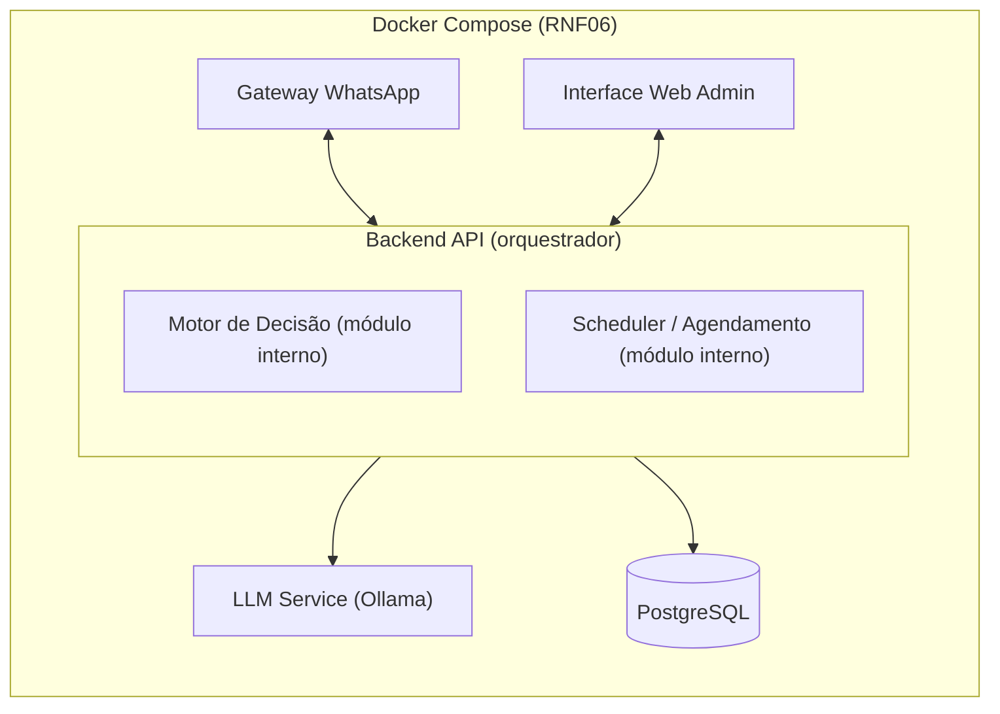

# Arquitetura — Chatbot de Orientação ao Consumidor (PROCON Jacareí)

## Visão geral

## Camadas do sistema

Não são serviços 1:1 — são responsabilidades separadas conforme RP03 (modularidade).

1. **Gateway WhatsApp** — canal de entrada/saída de mensagens com o cidadão.
2. **Interface Web Admin** — painel autenticado da equipe do Procon (login único, sem perfis diferenciados — RF12).
3. **Backend API (orquestrador)** — contém internamente, como módulos de código (não containers separados):
   - **Motor de Decisão** — lê categorias/perguntas do banco e decide a navegação do fluxo.
   - **Scheduler / Agendamento** — aciona quando o fluxo não resolve a dúvida (RF07).
4. **Serviço de LLM** — container separado (Ollama + modelo local), usado **só** para gerar o texto explicativo final, nunca para decidir o fluxo.
5. **Banco de dados (PostgreSQL)** — persistência única, compartilhada entre chatbot e admin.

## Por que o Motor de Decisão fica dentro do Backend

- É leve, síncrono, só lê dados do banco — não há custo computacional que justifique isolar.
- Evita latência extra de chamada de rede a cada mensagem.
- O RP03 pede modularidade lógica (organização do código), não necessariamente infraestrutura separada.
- Só o LLM Service compensa isolamento por ter peso diferente (modelo carregado em memória).

## Stack

- **Backend:** Node.js + TypeScript — decisão já tomada e implementada na #5 (branch
  `feat/5-backend-base`, status `implementada`), não mais uma alternativa em aberto frente a
  Python (FastAPI).
- **Banco:** PostgreSQL.
- **LLM local:** Ollama + modelo pequeno (Llama 3.1 8B / Phi-3 / Mistral 7B).
- **WhatsApp:** WhatsApp Cloud API ou simulador acadêmico (RP01).
- **Admin:** React ou server-rendered simples.
- **Orquestração:** Docker Compose (RNF06).

## Fluxo de uma conversa

1. Usuário manda mensagem → Gateway recebe via webhook.
2. Gateway repassa ao Backend, que identifica a sessão.
3. Backend consulta o Motor de Decisão → retorna opções do nó atual.
4. Repete até o fim do fluxo.
5. No nó final: Backend monta resumo estruturado → LLM Service só "traduz" isso em texto natural (RF05).
6. Se não resolveu: aciona o Scheduler, cria agendamento (RF07).
7. Toda interação é logada localmente no banco (RF06) — não depende do histórico do WhatsApp.

## Modelo de dados planejado

O schema completo (tabelas, colunas, diagrama de entidades e `CREATE TABLE` de cada uma) vive em
[`.docs/database/database.md`](../database/database.md), que é a fonte de verdade para o modelo de
dados. Em resumo: `Categorias` e `Perguntas` sustentam o fluxo guiado do Motor de Decisão,
`DocumentosNecessarios` lista o que o cidadão precisa levar num atendimento presencial,
`Usuarios`/`Sessoes` identificam quem está conversando (com telefone tratado como hash, não em
texto puro — ver seção seguinte), `Interacoes` registra o histórico de cada conversa, e
`Agendamentos` cobre o acionamento presencial (RF07).

## Como esta arquitetura atende aos requisitos

- **RP05/RF05 (LLM não decide o fluxo):** no diagrama acima, o LLM Service não tem nenhuma
  conexão de volta ao Gateway, ao Admin, ao PostgreSQL, nem recebe estado de sessão — a única seta
  que chega até ele parte do Backend, já com o resumo estruturado que o Motor de Decisão (módulo
  interno do Backend) decidiu. O LLM Service só recebe esse resumo e devolve texto explicativo; ele
  não tem acesso a categorias/perguntas do banco nem à sessão do usuário para poder decidir para
  onde a conversa vai.
- **RNF06 (Docker):** todos os componentes do diagrama — Gateway WhatsApp, Interface Web Admin,
  Backend API, LLM Service e PostgreSQL — estão desenhados dentro do agrupamento
  `Docker Compose (RNF06)`, ou seja, cada um sobe como serviço do mesmo `docker-compose.yml`
  (a definição do arquivo de compose em si é escopo da #6, não desta spec).
- **RNF03 (LGPD / dado de telefone):** o número de telefone do cidadão nunca é persistido em texto
  puro — a tabela `Sessoes` (ver `.docs/database/database.md`) guarda `telefone_hash`, não o
  telefone bruto. Como `Sessoes` fica no PostgreSQL único (compartilhado entre Backend e Admin), a
  proteção do dado se dá na camada de persistência, antes de qualquer consulta pelo Admin.

## Restrições relevantes

- **RP05:** proibido usar APIs externas de LLM (custo + LGPD) — o LLM deve ser local.
- **RNF03:** conformidade com a LGPD.
- **RNF04/RNF05:** toda resposta final deve deixar explícito seu caráter orientativo (não vinculante) e sinalizar o que foi gerado por LLM.

