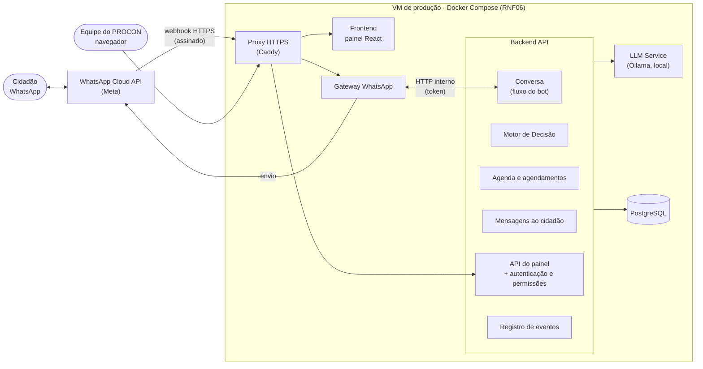
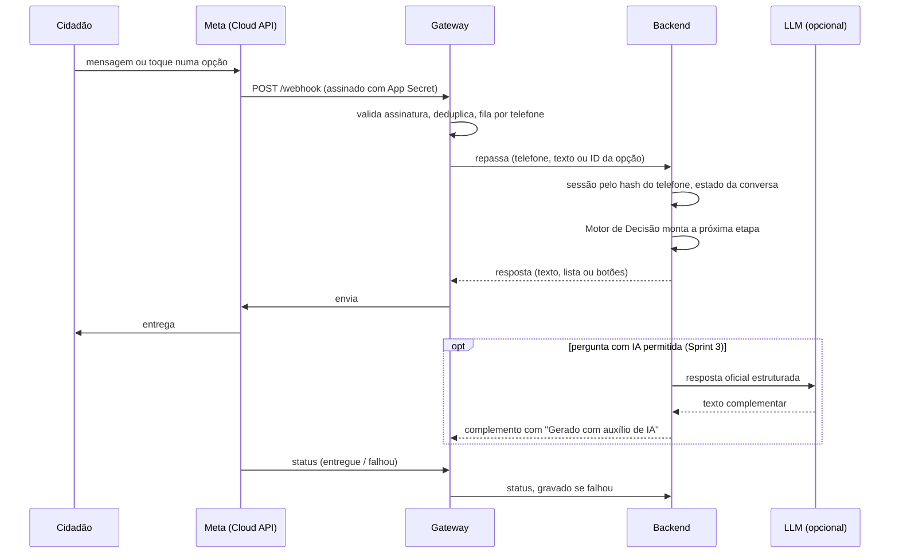

# Arquitetura — ProconChat Jacareí

> Atualizado em 27/09/2026, depois da revisão do protótipo do painel. Este documento descreve a arquitetura **alvo da entrega (23/11/2026)** e marca o que já está implementado. As decisões que levaram a ela estão em [`../decisoes/`](../decisoes/); as regras de cada tela, em [`../regras/`](../regras/).

**Legenda de estado:** ✅ implementado em `develop` · 🟡 planejado para a Sprint 2 · 🟠 planejado para a Sprint 3.

## Visão geral

```mermaid
flowchart LR
    Cidadao(["Cidadão<br/>WhatsApp"])
    Equipe(["Equipe do PROCON<br/>navegador"])
    Meta["WhatsApp Cloud API<br/>(Meta)"]

    subgraph vm["VM de produção · Docker Compose (RNF06)"]
        Proxy["Proxy HTTPS<br/>(Caddy)"]
        Front["Frontend<br/>painel React"]
        Gateway["Gateway WhatsApp"]

        subgraph Backend["Backend API"]
            direction TB
            Conversa["Conversa<br/>(fluxo do bot)"]
            Motor["Motor de Decisão"]
            Agenda["Agenda e agendamentos"]
            Avisos["Mensagens ao cidadão"]
            Painel["API do painel<br/>+ autenticação e permissões"]
            Registro["Registro de eventos"]
        end

        LLM["LLM Service<br/>(Ollama, local)"]
        DB[("PostgreSQL")]
    end

    Cidadao <--> Meta
    Meta -- "webhook HTTPS<br/>(assinado)" --> Proxy
    Proxy --> Gateway
    Gateway -- "envio" --> Meta
    Equipe --> Proxy
    Proxy --> Front
    Proxy --> Painel
    Gateway <-- "HTTP interno<br/>(token)" --> Conversa
    Backend --> LLM
    Backend --> DB
```

O LLM Service só recebe chamadas do Backend e não tem acesso ao banco nem à sessão: ele **não tem como** decidir o fluxo (RP05). O Gateway não tem acesso ao banco nem aos segredos de hash: o tratamento de dados pessoais fica concentrado no Backend (RNF03).

## Componentes

| Componente | Papel | Container | Estado |
|---|---|---|---|
| **Gateway WhatsApp** | Recebe o webhook da Meta, valida a assinatura, deduplica e repassa ao Backend; envia as mensagens pedidas pelo Backend (texto, lista, botões, modelos); repassa os status de entrega | `gateway` | ✅ com Evolution API · 🟡 migração para a Cloud API (S2-04) |
| **Backend API** | Orquestrador: conversa, Motor de Decisão, agenda, mensagens ao cidadão, registro de eventos, API do painel, autenticação e permissões | `backend` | ✅ parcial (sessão + Motor de Decisão) · 🟡🟠 demais módulos |
| **Frontend (painel)** | Painel da equipe do PROCON (RF08), a partir do `template-react` | `frontend` (nginx) | 🟡 S2-10 |
| **LLM Service** | Ollama com `llama3.2:3b`; gera só o texto complementar (RF05) | `ollama` + `llm-pull` | ✅ serviço pronto · 🟠 ligado ao fluxo (S3-05) |
| **PostgreSQL** | Persistência única | `postgres` (+ `migrate`, `seed`) | ✅ · 🟡 schema da Sprint 2 (S2-03) |
| **Proxy HTTPS** | Certificado e roteamento para painel, API e webhook; bloqueia a rota interna `/api/v1/whatsapp/sessions` | `caddy` | ✅ (`compose.prod.yaml`, `deploy/Caddyfile`) |
| ~~Evolution API + Redis~~ | Integração não oficial usada na Sprint 1 | `evolution-api`, `redis` | Saem na migração (S2-04). Ver [decisão 003](../decisoes/003-migracao-whatsapp-cloud-api.md) |

### Módulos do Backend

Não são containers separados: são módulos de código, organizados no padrão Controller → Service → Repository. O RP03 pede modularidade **lógica**; só o LLM justifica um container próprio, porque carrega um modelo inteiro em memória.

| Módulo | Responsabilidade | Estado |
|---|---|---|
| **Conversa** | Máquina de estados do bot: saudação, listas, "resolveu?", agendamento, retorno, timeout de 30 minutos, pausa | ✅ parcial · 🟡 S2-06, S2-07, S2-11 |
| **Motor de Decisão** | Lê categorias e perguntas do banco e monta as opções e a resposta final. Não guarda estado | ✅ · 🟡 paginação e categoria oculta (S2-06) |
| **Agenda** | Calcula horários livres a partir da configuração; cria, remarca e cancela agendamentos; controla vagas com concorrência | 🟡 S2-07, S2-11 |
| **Mensagens ao cidadão** | Monta os textos fixos (confirmação, pausa) e os modelos (cancelamento, lembrete); registra falhas de envio | 🟡 S2-07 · 🟠 S3-06 |
| **Registro de eventos** | Grava cada passo da conversa e o desfecho da sessão | 🟡 S2-08 |
| **API do painel** | Agendamentos, conteúdo, configuração, usuários, relatórios, configuração do WhatsApp | 🟡 S2-05, S2-12 · 🟠 S3 |
| **Autenticação e permissões** | Login, sessão, `requirePermission` com 8 permissões; na Sprint 2 só a conta Admin | 🟡 S2-09 · 🟠 S3-01 |
| **LLM** | Cliente do Ollama com fallback; envio do complemento com rótulo | ✅ cliente · 🟠 S3-05 |

## Fluxos principais

### Mensagem do cidadão

```mermaid
sequenceDiagram
    participant C as Cidadão
    participant M as Meta (Cloud API)
    participant G as Gateway
    participant B as Backend
    participant L as LLM (opcional)

    C->>M: mensagem ou toque numa opção
    M->>G: POST /webhook (assinado com App Secret)
    G->>G: valida assinatura, deduplica, fila por telefone
    G->>B: repassa (telefone, texto ou ID da opção)
    B->>B: sessão pelo hash do telefone, estado da conversa
    B->>B: Motor de Decisão monta a próxima etapa
    B-->>G: resposta (texto, lista ou botões)
    G->>M: envia
    M->>C: entrega
    opt pergunta com IA permitida (Sprint 3)
        B->>L: resposta oficial estruturada
        L-->>B: texto complementar
        B-->>G: complemento com "Gerado com auxílio de IA"
    end
    M->>G: status (entregue / falhou)
    G->>B: status, gravado se falhou
```

### Mensagem iniciada pelo sistema

Aviso de cancelamento pela equipe (🟠 S3-06) e lembrete (bônus). O Backend decifra o telefone guardado no agendamento e pede ao Gateway o envio de um **modelo aprovado pela Meta**, porque fora da janela de 24h não se pode enviar texto livre. Ver [decisão 005](../decisoes/005-mensagens-ao-cidadao.md).

### Configuração do WhatsApp

As credenciais da Cloud API ficam no banco, **criptografadas com uma chave-mestra do `.env`**, e são editadas pela tela de WhatsApp (só Admin). O Gateway busca a configuração no Backend por um endpoint interno, guarda em cache e recarrega quando o Admin salva. Assim o PROCON troca o número sem mexer no servidor.

## Infraestrutura e entrega

| Ambiente | Onde | WhatsApp |
|---|---|---|
| **Desenvolvimento** | Máquina de cada pessoa (`docker compose up`) + túnel HTTPS | App de teste próprio na Meta, com o número de teste gratuito da Meta |
| **Produção / demonstração** | VM AWS EC2 `t4g.small` (arm64, 2 GB + 2 GB de swap) em `us-east-2`, com `compose.prod.yaml`: `caddy`, `postgres`, `migrate`, `seed`, `backend`, `gateway` e `frontend`. Sem Evolution e Redis. O Ollama (`ollama` e `llm-pull`, perfil `llm`) fica desligado até haver uma VM com mais memória (#66) | Número real da equipe; depois das sprints, o número do PROCON |

- **CI** (🟡 S2-01): GitHub Actions roda build, lint e testes de cada app em todo PR. O CI verde é obrigatório para o merge.
- **CD** (✅ #51): push com CI verde na branch de `DEPLOY_BRANCH` (hoje `develop`; `main` no fim do semestre) gera as imagens no GitHub Container Registry e atualiza a VM por SSH com `deploy/deploy.sh <sha>`. As migrations rodam pelo serviço `migrate`. Operação, rollback e backup: [`infra/deploy.md`](../infra/deploy.md).
- **Segredos:** no GitHub, só os de acesso SSH (environment `production`); os da aplicação ficam no `.env` da VM. Continuam no `.env`: banco, `PHONE_HASH_SECRET`, token interno Gateway ↔ Backend, chave-mestra de criptografia e URL pública.

## Segurança e dados pessoais

- **Telefone:** nas sessões, só o hash (`phone_hash`); nos agendamentos, criptografado e apagado quando o agendamento termina. Nunca aparece no painel.
- **CPF:** hash + versão mascarada. O CPF completo nunca é exibido.
- **Texto digitado pelo cidadão:** não é gravado.
- **Webhook:** só aceita eventos com assinatura válida da Meta.
- **Painel:** toda rota exige sessão e a permissão correspondente, validadas no servidor. As regras contra escalada de privilégio estão na [decisão 004](../decisoes/004-contas-e-permissoes-granulares.md).
- Detalhes: [decisão 002](../decisoes/002-lgpd-dados-pessoais.md).

## Stack

| Camada | Tecnologia |
|---|---|
| Backend e Gateway | Node.js + TypeScript, Express, Vitest |
| Frontend | React 19 + Vite + TypeScript, React Router, Vitest + Testing Library, oxlint + prettier (a partir do `template-react`) |
| Banco | PostgreSQL 15, migrations com `node-pg-migrate` |
| LLM | Ollama + `llama3.2:3b` (local; RP05) |
| WhatsApp | WhatsApp Cloud API (Meta) |
| Infra | Docker Compose, Caddy, GitHub Actions, GitHub Container Registry, VM na nuvem |

## Modelo de dados

Ver [`../database/database.md`](../database/database.md): o schema atual e o planejado para as Sprints 2 e 3.

## Como a arquitetura atende aos requisitos

| Requisito | Como |
|---|---|
| RF01, RP01 | Cloud API oficial pelo Gateway |
| RF02, RF03 | Motor de Decisão e Conversa, com listas e botões tocáveis (a escolha chega como ID, não como texto interpretado) |
| RF04, RNF04 | Resposta final montada no Backend com "O que fazer agora" e o aviso de texto único |
| RF05, RNF05, RP05 | LLM local, chamado só pelo Backend, sem acesso ao banco; complemento sempre rotulado |
| RF06 | Registro de eventos e desfechos; relatórios agregados |
| RF07 | Módulos Agenda e Mensagens ao cidadão |
| RF08 | Frontend + API do painel com permissões |
| RNF02 | Resposta oficial não espera o LLM; `restart` e healthchecks; Cloud API em vez de automação não oficial |
| RNF03 | Seção "Segurança e dados pessoais" |
| RNF06 | Tudo no Docker Compose |
| RNF08 | CI em todo PR e CD a cada push com CI verde na branch de `DEPLOY_BRANCH` (`develop` durante o semestre, `main` no fim) |
| RP03 | Gateway, Backend e LLM separados; módulos internos no Backend |
