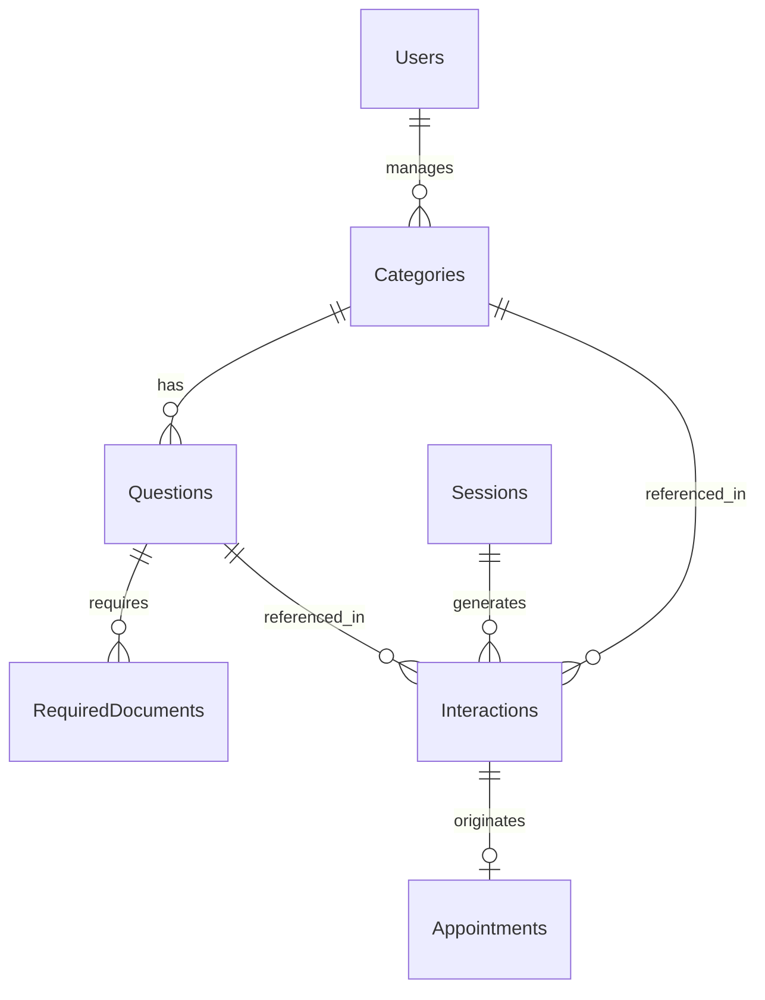

# Modelo de Banco de Dados — Chatbot de Orientação ao Consumidor

> Reflete a arquitetura em [`architecture.md`](../architecture/architecture.md) —
> persistência única em PostgreSQL, compartilhada entre chatbot e admin.
>
> Convenções seguem o padrão já implementado no extinto `src/backend/db/create.sql`
> (tabela `Appointments`) — mas com os identificadores traduzidos para inglês:
> `BIGSERIAL` como PK, nomes de tabela em PascalCase (inglês), colunas em snake_case
> (inglês), `TIMESTAMPTZ`, `ENUM` para status, `CHECK` para validações simples, índices
> nas colunas de busca/filtro.

## Diagrama (visão geral)



## Tabelas

### Categories

Conteúdo gerenciável pela equipe do Procon (RF09/RF10/RF11). Categorização definida pelo grupo (ex: Cobrança/Desconto Indevido, Contrato, Direito de Arrependimento, etc.).

```sql
CREATE TABLE Categories (
    id BIGSERIAL PRIMARY KEY,
    title VARCHAR(150) NOT NULL,
    description TEXT,
    active BOOLEAN NOT NULL DEFAULT TRUE,
    created_at TIMESTAMPTZ NOT NULL DEFAULT CURRENT_TIMESTAMP,
    updated_at TIMESTAMPTZ NOT NULL DEFAULT CURRENT_TIMESTAMP
);

CREATE INDEX idx_categories_active ON Categories(active);
```

`active` implementa RF11 — desativar sem excluir, preservando histórico de interações.

### Questions

Um item do fluxo decisório dentro de uma categoria — corresponde a um item do FAQ do Procon.

```sql
CREATE TABLE Questions (
    id BIGSERIAL PRIMARY KEY,
    category_id BIGINT NOT NULL REFERENCES Categories(id),

    question TEXT NOT NULL,
    legal_basis TEXT,
    answer TEXT NOT NULL,

    requires_in_person BOOLEAN NOT NULL DEFAULT FALSE,
    in_person_note TEXT,
    out_of_scope BOOLEAN NOT NULL DEFAULT FALSE,

    active BOOLEAN NOT NULL DEFAULT TRUE,

    created_at TIMESTAMPTZ NOT NULL DEFAULT CURRENT_TIMESTAMP,
    updated_at TIMESTAMPTZ NOT NULL DEFAULT CURRENT_TIMESTAMP
);

CREATE INDEX idx_questions_category ON Questions(category_id);
CREATE INDEX idx_questions_active ON Questions(active);
```

Campos espelham 1:1 o formato do FAQ real enviado pelo Procon (~47 itens).

### RequiredDocuments

Lista de documentos exigidos por uma pergunta (0..N, às vezes vazia).

```sql
CREATE TABLE RequiredDocuments (
    id BIGSERIAL PRIMARY KEY,
    question_id BIGINT NOT NULL REFERENCES Questions(id),
    description VARCHAR(255) NOT NULL
);

CREATE INDEX idx_required_documents_question ON RequiredDocuments(question_id);
```

### Users

Conta de acesso ao painel admin (RF12 — login/senha, perfil único, sem RBAC).

```sql
CREATE TABLE Users (
    id BIGSERIAL PRIMARY KEY,
    name VARCHAR(150) NOT NULL,
    email VARCHAR(150) NOT NULL UNIQUE,
    password_hash TEXT NOT NULL,
    active BOOLEAN NOT NULL DEFAULT TRUE,
    created_at TIMESTAMPTZ NOT NULL DEFAULT CURRENT_TIMESTAMP
);
```

Sem coluna de papel/role — decisão do grupo (RF12) foi um único nível de permissão para toda a equipe.

### Sessions

Uma conversa no WhatsApp, do início ao fim do fluxo. O telefone é armazenado como hash, não em texto puro, para conformidade com LGPD (RNF03/RNF09).

```sql
CREATE TYPE session_status AS ENUM ('IN_PROGRESS', 'FINISHED', 'ABANDONED');

CREATE TABLE Sessions (
    id BIGSERIAL PRIMARY KEY,
    session_code UUID NOT NULL DEFAULT gen_random_uuid(),

    phone_hash VARCHAR(64) NOT NULL,

    status session_status NOT NULL DEFAULT 'IN_PROGRESS',

    started_at TIMESTAMPTZ NOT NULL DEFAULT CURRENT_TIMESTAMP,
    ended_at TIMESTAMPTZ
);

CREATE INDEX idx_sessions_phone_hash ON Sessions(phone_hash);
CREATE INDEX idx_sessions_code ON Sessions(session_code);
```

`phone_hash` sozinho não é suficiente para conformidade total — a política de retenção/anonimização
(RNF09, ainda a formalizar) deve definir por quanto tempo a sessão é mantida e quando o hash é descartado.

### Interactions

Registro estruturado de cada passo do fluxo, local, independente do histórico do WhatsApp (RF06/RF14).

```sql
CREATE TABLE Interactions (
    id BIGSERIAL PRIMARY KEY,
    session_id BIGINT NOT NULL REFERENCES Sessions(id),
    category_id BIGINT REFERENCES Categories(id),
    question_id BIGINT REFERENCES Questions(id),

    answered_via_llm BOOLEAN NOT NULL DEFAULT FALSE,
    llm_answer_text TEXT,

    ended_in_appointment BOOLEAN NOT NULL DEFAULT FALSE,

    created_at TIMESTAMPTZ NOT NULL DEFAULT CURRENT_TIMESTAMP
);

CREATE INDEX idx_interactions_session ON Interactions(session_id);
CREATE INDEX idx_interactions_category ON Interactions(category_id);
CREATE INDEX idx_interactions_question ON Interactions(question_id);
```

`category_id`/`question_id` ficam nulos em interações que não chegam a escolher uma pergunta
(ex: usuário abandona no meio do fluxo). `answered_via_llm` sustenta a rastreabilidade exigida
pela RNF05 (identificar o que foi gerado com auxílio de LLM).

### Appointments *(já implementado em `create.sql`)*

Atendimento presencial acionado quando o fluxo não resolve a dúvida (RF07). Definição atual:

```sql
CREATE TYPE appointment_status AS ENUM ('SCHEDULED', 'CANCELED', 'ATTENDED');

CREATE TABLE Appointments (
    id BIGSERIAL PRIMARY KEY,
    appointment_code UUID NOT NULL DEFAULT gen_random_uuid(),

    cpf_hash VARCHAR(64) NOT NULL,
    name VARCHAR(150) NOT NULL,

    appointment_reason TEXT NOT NULL,

    professional VARCHAR(50) NOT NULL CHECK (professional IN ('LAWYER', 'ATTENDANT')),

    appointment_datetime TIMESTAMPTZ NOT NULL,
    request_datetime TIMESTAMPTZ NOT NULL DEFAULT CURRENT_TIMESTAMP,

    status appointment_status NOT NULL DEFAULT 'SCHEDULED',

    notes TEXT
);

CREATE INDEX idx_appointments_cpf_hash ON Appointments(cpf_hash);
CREATE INDEX idx_appointments_code ON Appointments(appointment_code);
CREATE INDEX idx_appointments_datetime ON Appointments(appointment_datetime);

CREATE UNIQUE INDEX uniq_appointments_active
ON Appointments(cpf_hash, appointment_datetime)
WHERE status = 'SCHEDULED';
```

O CPF chega em texto puro no Backend (via mensagem do WhatsApp, quando o Motor de Decisão aciona
o agendamento presencial — RF07, ou via request da equipe do Procon pela Interface Web Admin —
RF13) e é hasheado (mesmo mecanismo de `phone_hash`) só no momento de persistir, nunca guardado em
texto puro — decisão de RNF03/RNF09. O `CHECK` de formato de CPF (`^[0-9]{11}$`) saiu, já que o
valor guardado deixa de ser o CPF em si (11 dígitos) e passa a ser o hash dele; a validação do
formato do CPF passa a ser responsabilidade da camada de aplicação, antes de hashear. `name`
continua em texto puro — a equipe do Procon precisa identificar a pessoa visualmente no admin.

**Evolução sugerida (ainda não aplicada):** ligar o agendamento à interação de origem, para
rastrear de qual ponto do fluxo ele nasceu (RF13 — gestão de atendimentos agendados no admin
fica mais completa sabendo o contexto do caso):

```sql
ALTER TABLE Appointments
    ADD COLUMN interaction_id BIGINT REFERENCES Interactions(id);
```

## Relacionamentos

- `Categories 1—N Questions`
- `Questions 1—N RequiredDocuments`
- `Sessions 1—N Interactions`
- `Categories 1—N Interactions`, `Questions 1—N Interactions` (nulável)
- `Interactions 1—0/1 Appointments` (via `interaction_id`, sugerido)
- `Users` não se relaciona diretamente com dados do fluxo — é só a conta de acesso ao admin

## Pendências relacionadas a este modelo

- Formalizar RNF09 (política de retenção/anonimização de `phone_hash` em `Sessions` e de
  `cpf_hash` em `Appointments` — por quanto tempo manter o hash, quando descartar)
- Decidir se vale aplicar a "evolução sugerida" acima — ligar `Appointments` a `Sessions`/
  `Interactions` via `interaction_id`. Hoje um agendamento é um registro isolado, identificável só
  por `cpf_hash`/nome; ele não guarda de qual conversa do WhatsApp (sessão), categoria ou pergunta
  ele se originou. Aplicar essa coluna daria rastreabilidade completa do caso — a equipe do Procon
  veria, ao abrir um agendamento no admin, todo o histórico da conversa que levou a ele (RF13). Sem
  ela, o agendamento fica desconectado do atendimento automatizado que o originou.
- Script de seed com os ~47 itens reais do FAQ para popular `Categories`/`Questions`/`RequiredDocuments`
