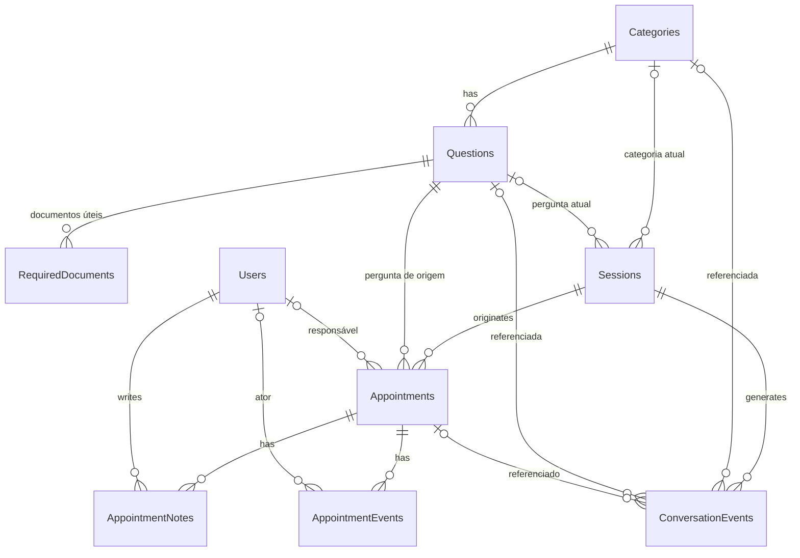

# Modelo de banco de dados — ProconChat Jacareí

> Persistência única em PostgreSQL, compartilhada entre o chatbot e o painel ([`../architecture/architecture.md`](../architecture/architecture.md)).
>
> Este documento tem duas partes:
> 1. **[Schema atual](#parte-1--schema-atual-implementado)**: o que existe depois das migrations `01` a `09`, `010` e `11` (a `11_sprint2_schema.sql` é o schema da Sprint 2, issue #52).
> 2. **[Schema planejado](#parte-2--schema-planejado-sprint-3)**: o que ainda falta criar, com a issue de cada parte.
>
> Antes de mexer no banco, leia também o SQL em `src/backend/db/schema/` e as convenções em [`migrations.md`](migrations.md): **toda mudança é uma migration nova**, nunca edição de migration antiga.

**Convenções:** `BIGSERIAL` como chave primária; tabelas em PascalCase sem aspas (o PostgreSQL grava em minúsculas: `RequiredDocuments` vira `requireddocuments`) e colunas em snake_case, em inglês; `TIMESTAMPTZ`; `ENUM` para estados; `CHECK` com nome (`chk_<tabela>_<regra>`) para as validações que não dependem de outras linhas; índices nas colunas de busca e filtro. Os `TIME` e `DATE` da agenda são horário local de Brasília; a conversão para `TIMESTAMPTZ` é feita pela aplicação com `America/Sao_Paulo`.

---

## Parte 1 — Schema atual (implementado)

### Histórico das migrations

| Migration | O que faz |
|---|---|
| `01` a `07` | Tabelas da Sprint 1 (#9, #11): `Users`, `Categories`, `Questions`, `RequiredDocuments`, `Sessions`, `Interactions`, `Appointments` |
| `08` | Uma única sessão em andamento por telefone (`uniq_sessions_phone_in_progress`) |
| `09` | Estado de navegação da sessão (`current_step`, `current_category_id`) |
| `010` | `current_category_id` com `ON DELETE SET NULL`, para o seed conseguir apagar categorias. O prefixo é lido como número: `010` é a versão 10 |
| `11` | Schema da Sprint 2 (#52): conta Admin, títulos curtos e ordem do conteúdo, desfecho e rascunho da sessão, `ConversationEvents` no lugar de `Interactions`, `Appointments` recriada com o ciclo de vida novo, observações e histórico do agendamento, agenda, documentos de atendimento e configuração do WhatsApp |

### Diagrama


```mermaid
erDiagram
    Categories ||--o{ Questions : has
    Questions ||--o{ RequiredDocuments : "documentos úteis"
    Categories |o--o{ Sessions : "categoria atual"
    Questions |o--o{ Sessions : "pergunta atual"
    Sessions ||--o{ ConversationEvents : generates
    Categories |o--o{ ConversationEvents : "referenciada"
    Questions |o--o{ ConversationEvents : "referenciada"
    Appointments |o--o{ ConversationEvents : "referenciado"
    Sessions ||--o{ Appointments : originates
    Questions ||--o{ Appointments : "pergunta de origem"
    Users |o--o{ Appointments : "responsável"
    Appointments ||--o{ AppointmentNotes : has
    Users ||--o{ AppointmentNotes : writes
    Appointments ||--o{ AppointmentEvents : has
    Users |o--o{ AppointmentEvents : "ator"
```

Tabelas de configuração, sem relação com as demais além de `updated_by` → `Users`: `ScheduleSettings`, `ScheduleRanges`, `BlockedDates`, `AttendanceDocuments` e `WhatsAppSettings`. `Categories` e `Questions` também têm `updated_by` → `Users`.

A extensão `unaccent` é criada na migration `11`, para a busca de agendamentos pelo nome sem diferenciar acentos (#60).

```sql
CREATE EXTENSION IF NOT EXISTS unaccent;
```

### Users — [decisão 004](../decisoes/004-contas-e-permissoes-granulares.md)

Contas do painel. A conta Admin é marcada por `is_admin`, e `uniq_users_single_admin` garante que existe **no máximo um Admin**. O seed da conta Admin é da #57.

```sql
CREATE TABLE Users (
    id BIGSERIAL PRIMARY KEY,
    name VARCHAR(150) NOT NULL,
    email VARCHAR(150) NOT NULL UNIQUE,
    password_hash TEXT NOT NULL,
    active BOOLEAN NOT NULL DEFAULT TRUE,
    created_at TIMESTAMPTZ NOT NULL DEFAULT CURRENT_TIMESTAMP,
    is_admin BOOLEAN NOT NULL DEFAULT FALSE,
    last_login_at TIMESTAMPTZ,
    session_version INTEGER NOT NULL DEFAULT 0,
    CONSTRAINT chk_users_session_version CHECK (session_version >= 0)
);

CREATE UNIQUE INDEX uniq_users_single_admin ON Users(is_admin) WHERE is_admin;
```

- **Autenticação por JWT (#57), sem tabela de sessões de login.** O token carrega o `session_version` da conta no momento em que foi emitido. A cada requisição, o backend recusa o token se a versão for diferente da atual ou se a conta não estiver ativa (`active`). **Incrementar `session_version` invalida todos os tokens já emitidos daquela conta.**
- Quando incrementar é regra da aplicação ([`regras/01-login-e-conta.md`](../regras/01-login-e-conta.md)): **"Alterar minha senha" não incrementa** (a sessão atual continua valendo e a nova senha vale a partir do próximo acesso); uma conta desativada não entra pela checagem de `active`; não existe "esqueci minha senha".
- As permissões granulares ficam para a #62 (Parte 2). Na Sprint 2, o middleware só libera `is_admin`.

### Categories — [decisões 001](../decisoes/001-fluxo-guiado-por-categorias.md) e [009](../decisoes/009-complemento-por-llm.md)

Categorias do fluxo guiado (7 no seed atual). `active` permite desativar sem excluir.

```sql
CREATE TABLE Categories (
    id BIGSERIAL PRIMARY KEY,
    title VARCHAR(150) NOT NULL,
    description TEXT,
    active BOOLEAN NOT NULL DEFAULT TRUE,
    created_at TIMESTAMPTZ NOT NULL DEFAULT CURRENT_TIMESTAMP,
    updated_at TIMESTAMPTZ NOT NULL DEFAULT CURRENT_TIMESTAMP,
    short_title TEXT NOT NULL,
    position INT NOT NULL DEFAULT 0,
    seed_key VARCHAR(80),
    updated_by BIGINT REFERENCES Users(id),
    CONSTRAINT chk_categories_short_title_length CHECK (char_length(btrim(short_title)) BETWEEN 1 AND 24),
    CONSTRAINT chk_categories_position CHECK (position >= 0),
    CONSTRAINT uniq_categories_seed_key UNIQUE (seed_key)
);

CREATE INDEX idx_categories_active ON Categories(active);
CREATE INDEX idx_categories_position ON Categories(position, id);
```

### Questions

Um item do FAQ do PROCON dentro de uma categoria (47 no seed atual).

```sql
CREATE TABLE Questions (
    id BIGSERIAL PRIMARY KEY,
    category_id BIGINT NOT NULL REFERENCES Categories(id),

    question TEXT NOT NULL,
    legal_basis TEXT,
    answer TEXT NOT NULL,

    requires_in_person BOOLEAN NOT NULL DEFAULT FALSE,
    in_person_note TEXT,
    out_of_scope BOOLEAN NOT NULL DEFAULT FALSE,

    active BOOLEAN NOT NULL DEFAULT TRUE,

    created_at TIMESTAMPTZ NOT NULL DEFAULT CURRENT_TIMESTAMP,
    updated_at TIMESTAMPTZ NOT NULL DEFAULT CURRENT_TIMESTAMP,

    short_title TEXT NOT NULL,
    short_description TEXT,
    position INT NOT NULL DEFAULT 0,
    llm_allowed BOOLEAN NOT NULL DEFAULT TRUE,
    seed_key VARCHAR(80),
    updated_by BIGINT REFERENCES Users(id),

    CONSTRAINT chk_questions_short_title_length CHECK (char_length(btrim(short_title)) BETWEEN 1 AND 24),
    CONSTRAINT chk_questions_short_description_length CHECK (short_description IS NULL OR char_length(btrim(short_description)) BETWEEN 1 AND 72),
    CONSTRAINT chk_questions_position CHECK (position >= 0),
    CONSTRAINT chk_questions_in_person_xor_out_of_scope CHECK (NOT (requires_in_person AND out_of_scope)),
    CONSTRAINT chk_questions_out_of_scope_no_llm CHECK (NOT (out_of_scope AND llm_allowed)),
    CONSTRAINT chk_questions_answer_length CHECK (char_length(answer) <= 3000),
    CONSTRAINT uniq_questions_seed_key UNIQUE (seed_key)
);

CREATE INDEX idx_questions_category ON Questions(category_id);
CREATE INDEX idx_questions_active ON Questions(active);
CREATE INDEX idx_questions_category_position ON Questions(category_id, position, id);
```

### RequiredDocuments

"Documentos úteis para esta dúvida", de cada pergunta (0..N), na ordem de `position`.

```sql
CREATE TABLE RequiredDocuments (
    id BIGSERIAL PRIMARY KEY,
    question_id BIGINT NOT NULL REFERENCES Questions(id),
    description VARCHAR(255) NOT NULL,
    position INT NOT NULL DEFAULT 0,
    CONSTRAINT chk_required_documents_position CHECK (position >= 0)
);

CREATE INDEX idx_required_documents_question ON RequiredDocuments(question_id);
```

**Regras do conteúdo garantidas pelo banco:**

- **Títulos curtos** (`short_title`) são o texto das listas do WhatsApp: obrigatórios, de 1 a 24 caracteres (sem contar espaços nas pontas). São `TEXT` com o limite no `CHECK`. A migration `11` preencheu um valor provisório (`btrim(left(título, 24))`, às vezes cortado no meio da palavra), que a #61 refina só com `UPDATE`, sem migration nova.
- **Descrição curta** (`short_description`) é opcional e, quando preenchida, tem de 1 a 72 caracteres.
- Uma pergunta **não pode ser presencial e fora do escopo** ao mesmo tempo (`chk_questions_in_person_xor_out_of_scope`).
- **Fora do escopo nunca usa IA** (`chk_questions_out_of_scope_no_llm`): `llm_allowed` tem que ser `false` quando `out_of_scope` é `true`.
- A **resposta** tem no máximo 3.000 caracteres.
- **Ordem:** listas ordenadas por `position, id`. `position` não é `UNIQUE`, para a reordenação não precisar de constraint adiável.
- **`seed_key`** é a chave estável que a #61 usa para tornar o seed idempotente e não destrutivo (inserir o que falta e atualizar pela chave, em vez de apagar e recriar). Fica `NULL` nas linhas criadas pelo painel.
- **Categoria "oculta"** (ativa, mas sem nenhuma pergunta ativa) é regra de consulta, não coluna.
- Conteúdo não é apagado (decisão 001): as FKs de `ConversationEvents` e `Appointments` para `Categories`/`Questions` não têm cascade, então apagar uma pergunta com histórico falha.

### Sessions — [decisão 008](../decisoes/008-fluxo-da-conversa-e-desfechos.md)

Uma conversa no WhatsApp. O telefone é guardado só como hash (`phone_hash`, HMAC-SHA256 com `PHONE_HASH_SECRET`).

```sql
CREATE TYPE session_status AS ENUM ('IN_PROGRESS', 'FINISHED', 'ABANDONED');

CREATE TYPE session_step AS ENUM (
    'AWAITING_CATEGORY',
    'AWAITING_QUESTION',
    'AWAITING_ANSWER',
    'AWAITING_RESOLVED',
    'AWAITING_SCHEDULE_OFFER',
    'AWAITING_ATTENDEE',
    'AWAITING_HOLDER_NAME',
    'AWAITING_HOLDER_CPF',
    'AWAITING_SLOT',
    'AWAITING_RETURN_CHOICE',
    'AWAITING_CANCEL_CONFIRMATION',
    'FINISHED'
);

CREATE TYPE session_outcome AS ENUM (
    'IN_PROGRESS',
    'RESOLVED',
    'SCHEDULED',
    'OUT_OF_SCOPE',
    'NO_SLOT',
    'DECLINED',
    'MANAGED_APPOINTMENT',
    'ABANDONED'
);

CREATE TABLE Sessions (
    id BIGSERIAL PRIMARY KEY,
    session_code UUID NOT NULL DEFAULT gen_random_uuid(),

    phone_hash VARCHAR(64) NOT NULL,

    status session_status NOT NULL DEFAULT 'IN_PROGRESS',

    started_at TIMESTAMPTZ NOT NULL DEFAULT CURRENT_TIMESTAMP,
    ended_at TIMESTAMPTZ,

    current_step session_step NOT NULL DEFAULT 'AWAITING_CATEGORY',
    current_category_id BIGINT REFERENCES Categories(id) ON DELETE SET NULL,

    outcome session_outcome NOT NULL DEFAULT 'IN_PROGRESS',
    abandoned_at_step session_step,
    last_interaction_at TIMESTAMPTZ NOT NULL DEFAULT CURRENT_TIMESTAMP,
    current_question_id BIGINT REFERENCES Questions(id) ON DELETE SET NULL,
    list_page INT NOT NULL DEFAULT 1,
    draft JSONB,

    CONSTRAINT chk_sessions_outcome_in_progress CHECK ((status = 'IN_PROGRESS') = (outcome = 'IN_PROGRESS')),
    CONSTRAINT chk_sessions_outcome_abandoned CHECK ((status = 'ABANDONED') = (outcome = 'ABANDONED')),
    CONSTRAINT chk_sessions_abandoned_step CHECK ((outcome = 'ABANDONED') = (abandoned_at_step IS NOT NULL)),
    CONSTRAINT chk_sessions_list_page CHECK (list_page >= 1),
    CONSTRAINT chk_sessions_draft_only_in_progress CHECK (draft IS NULL OR status = 'IN_PROGRESS'),
    CONSTRAINT chk_sessions_draft_object CHECK (draft IS NULL OR jsonb_typeof(draft) = 'object'),
    CONSTRAINT chk_sessions_draft_keys CHECK (
        draft IS NULL
        OR (draft - ARRAY['by_representative', 'holder_name', 'cpf_hash', 'cpf_masked', 'target_appointment_id']) = '{}'::jsonb
    ),
    CONSTRAINT chk_sessions_draft_cpf CHECK (
        draft IS NULL
        OR (
            (draft ->> 'cpf_hash' IS NULL OR draft ->> 'cpf_hash' ~ '^[0-9a-f]{64}$')
            AND (draft ->> 'cpf_masked' IS NULL OR draft ->> 'cpf_masked' ~ '^\*{3}\.[0-9]{3}\.[0-9]{3}-\*{2}$')
        )
    )
);

CREATE INDEX idx_sessions_phone_hash ON Sessions(phone_hash);
CREATE INDEX idx_sessions_code ON Sessions(session_code);
CREATE INDEX idx_sessions_last_interaction ON Sessions(last_interaction_at) WHERE status = 'IN_PROGRESS';
CREATE INDEX idx_sessions_started_at ON Sessions(started_at);

CREATE UNIQUE INDEX uniq_sessions_phone_in_progress
ON Sessions(phone_hash)
WHERE status = 'IN_PROGRESS';
```

**`session_step`** (etapa em que a conversa está):

| Valor | Etapa |
|---|---|
| `AWAITING_CATEGORY` | Na lista de categorias |
| `AWAITING_QUESTION` | Na lista de perguntas |
| `AWAITING_ANSWER` | Aguardando a resposta, enquanto o complemento é gerado |
| `AWAITING_RESOLVED` | "A dúvida foi resolvida?" |
| `AWAITING_SCHEDULE_OFFER` | Agendar / Agora não |
| `AWAITING_ATTENDEE` | Quem vai comparecer |
| `AWAITING_HOLDER_NAME` | Nome completo do titular |
| `AWAITING_HOLDER_CPF` | CPF do titular |
| `AWAITING_SLOT` | Escolha do horário. Também usada na remarcação (#59), com `draft.target_appointment_id` indicando o agendamento |
| `AWAITING_RETURN_CHOICE` | Remarcar / Cancelar / Tenho outra dúvida (#59, Sprint 3) |
| `AWAITING_CANCEL_CONFIRMATION` | Confirmação do cancelamento por botão (#59, Sprint 3) |
| `FINISHED` | Conversa encerrada |

A correspondência entre etapa e os 6 nomes de abandono dos Relatórios é da aplicação (#16/#68).

**`session_outcome`** (desfecho, 8 valores, `NOT NULL DEFAULT 'IN_PROGRESS'`):

| Valor | Desfecho |
|---|---|
| `IN_PROGRESS` | Em andamento |
| `RESOLVED` | Resolvida sem agendamento |
| `SCHEDULED` | Terminou em agendamento |
| `OUT_OF_SCOPE` | Fora do escopo do PROCON |
| `NO_SLOT` | Sem horário disponível na janela |
| `DECLINED` | Não quis agendar |
| `MANAGED_APPOINTMENT` | Remarcou ou cancelou um agendamento existente |
| `ABANDONED` | 30 minutos sem interação |

"Em andamento" é um valor do enum, não `NULL`: os relatórios agrupam por `outcome` sem `COALESCE`.

**Regras garantidas pelo banco:**

- `status` e `outcome` andam juntos: `IN_PROGRESS` ⇔ `IN_PROGRESS` e `ABANDONED` ⇔ `ABANDONED`; `FINISHED` corresponde a um dos outros 6 desfechos. Encerrar uma sessão exige atualizar os dois no mesmo `UPDATE`.
- `abandoned_at_step` é obrigatória quando o desfecho é `ABANDONED`, e proibida nos demais.
- `list_page` (página da lista no WhatsApp) é ≥ 1.
- `last_interaction_at` sustenta o **timeout de 30 minutos**, com o índice parcial `idx_sessions_last_interaction` só nas sessões em andamento.
- `current_category_id` e `current_question_id` usam `ON DELETE SET NULL` (migration `010` e `11`), porque o seed atual apaga e recria o conteúdo.

**`draft`**: dados temporários entre as etapas do agendamento. Regras:

- só aceita as chaves `by_representative`, `holder_name`, `cpf_hash`, `cpf_masked` e `target_appointment_id` (`chk_sessions_draft_keys`). Uma chave nova exige migration, de propósito;
- `cpf_hash` tem que ser hex de 64 caracteres e `cpf_masked` tem que estar mascarado (`***.456.789-**`). **Não há onde pôr o CPF completo** (`chk_sessions_draft_cpf`);
- **é limpo em todo encerramento**, inclusive no abandono por timeout: nenhuma sessão fora de `IN_PROGRESS` pode ter `draft` (`chk_sessions_draft_only_in_progress`), então a varredura do timeout zera o `draft` no mesmo `UPDATE` que marca `ABANDONED`;
- **regra de aplicação:** o `draft` nunca aparece na tela de Sessões (nem na API dela) e nunca é copiado para `ConversationEvents.data` nem para `AppointmentEvents.data`.

**Backfill feito pela migration `11`** nas sessões que já existiam: `outcome` `IN_PROGRESS` → `IN_PROGRESS`, `ABANDONED` → `ABANDONED` e `FINISHED` → `RESOLVED`; `abandoned_at_step = current_step` nas abandonadas; `last_interaction_at = COALESCE(ended_at, started_at)`. O `RESOLVED` é **provisório até a #55**: nenhum dos desfechos descreve o fim do fluxo da Sprint 1 ("recebeu a resposta, sem pergunta de resolvido"), e `sessionRepository.finish()` grava o mesmo `RESOLVED` até a #55 substituir o fluxo.

### ConversationEvents — [decisão 010](../decisoes/010-registro-de-interacoes-e-relatorios.md)

Registro dos passos da conversa (RF06), base da linha do tempo da tela de Sessões e dos Relatórios. **Substituiu `Interactions`**, removida na migration `11`: nada gravava nela, o formato (uma linha por pergunta, com `llm_answer_text`) não representava os passos, e ela guardaria texto gerado que a decisão 010 não pede.

```sql
CREATE TYPE conversation_event_type AS ENUM (
    'STARTED',
    'CATEGORY_CHOSEN',
    'QUESTION_CHOSEN',
    'ANSWER_SENT',
    'RESOLVED_ANSWERED',
    'SCHEDULE_OFFERED',
    'NO_SLOT',
    'SCHEDULE_DECLINED',
    'ATTENDEE_CHOSEN',
    'PHONE_NOTICE_SHOWN',
    'APPOINTMENT_CREATED',
    'APPOINTMENT_CONSULTED',
    'APPOINTMENT_RESCHEDULED',
    'APPOINTMENT_CANCELED',
    'ABANDONED'
);

CREATE TABLE ConversationEvents (
    id BIGSERIAL PRIMARY KEY,
    session_id BIGINT NOT NULL REFERENCES Sessions(id) ON DELETE CASCADE,
    type conversation_event_type NOT NULL,
    category_id BIGINT REFERENCES Categories(id),
    question_id BIGINT REFERENCES Questions(id),
    appointment_id BIGINT REFERENCES Appointments(id),
    data JSONB NOT NULL DEFAULT '{}',
    created_at TIMESTAMPTZ NOT NULL DEFAULT CURRENT_TIMESTAMP,
    CONSTRAINT chk_conversation_events_data_object CHECK (jsonb_typeof(data) = 'object')
);

CREATE INDEX idx_conversation_events_session ON ConversationEvents(session_id, created_at);
CREATE INDEX idx_conversation_events_type_date ON ConversationEvents(type, created_at);
CREATE INDEX idx_conversation_events_category ON ConversationEvents(category_id);
CREATE INDEX idx_conversation_events_question ON ConversationEvents(question_id);
CREATE INDEX idx_conversation_events_appointment ON ConversationEvents(appointment_id);
```

| Tipo | `data` |
|---|---|
| `STARTED`, `CATEGORY_CHOSEN`, `QUESTION_CHOSEN` | — (ids nas colunas) |
| `ANSWER_SENT` | `{ "llm": "USED" \| "NOT_CALLED" \| "FAILED" }` |
| `RESOLVED_ANSWERED` | `{ "resolved": true \| false }` |
| `SCHEDULE_OFFERED` | `{ "reason": "REQUIRES_IN_PERSON" \| "NOT_RESOLVED" }` |
| `NO_SLOT`, `SCHEDULE_DECLINED` | — |
| `ATTENDEE_CHOSEN` | `{ "by_representative": true \| false }` |
| `PHONE_NOTICE_SHOWN` | — (o cidadão foi informado de que receberá avisos neste número, decisão 002, item 5) |
| `APPOINTMENT_CREATED`, `APPOINTMENT_CONSULTED`, `APPOINTMENT_CANCELED` | — (`appointment_id`) |
| `APPOINTMENT_RESCHEDULED` | `{ "from": ..., "to": ... }` |
| `ABANDONED` | `{ "step": "<session_step>" }` |

- **Nenhum evento guarda texto digitado pelo cidadão** (RNF03). `data` é sempre um objeto (`CHECK`) e só recebe as chaves acima (e as que a #16 documentar), com valores de lista fechada, booleanos, datas ou ids.
- `session_id` usa `ON DELETE CASCADE`: os eventos são parte da sessão (facilita a limpeza nos testes e a retenção da #69). `category_id`, `question_id` e `appointment_id` não usam cascade.

### Appointments — [decisão 006](../decisoes/006-ciclo-de-vida-do-agendamento.md)

Agendamentos presenciais (RF07, RF08). A migration `11` **recriou** a tabela (ela estava vazia, e quase todas as colunas mudaram): antes do `DROP`, uma guarda aborta a migration se houver alguma linha.

```sql
CREATE TYPE appointment_status AS ENUM ('PENDING', 'CONFIRMED', 'ATTENDED', 'NO_SHOW', 'CANCELED');
CREATE TYPE appointment_reason AS ENUM ('REQUIRES_IN_PERSON', 'NOT_RESOLVED');

CREATE TABLE Appointments (
    id BIGSERIAL PRIMARY KEY,
    appointment_code UUID NOT NULL DEFAULT gen_random_uuid(),

    session_id BIGINT NOT NULL REFERENCES Sessions(id),
    question_id BIGINT NOT NULL REFERENCES Questions(id),
    reason appointment_reason NOT NULL,

    name VARCHAR(150) NOT NULL,
    cpf_hash VARCHAR(64) NOT NULL,
    cpf_masked VARCHAR(14) NOT NULL,
    phone_encrypted TEXT,
    by_representative BOOLEAN NOT NULL DEFAULT FALSE,
    documents_sent JSONB NOT NULL,

    appointment_datetime TIMESTAMPTZ NOT NULL,
    rescheduled_from TIMESTAMPTZ,
    off_grid BOOLEAN NOT NULL DEFAULT FALSE,

    status appointment_status NOT NULL DEFAULT 'PENDING',
    assigned_user_id BIGINT REFERENCES Users(id),

    request_datetime TIMESTAMPTZ NOT NULL DEFAULT CURRENT_TIMESTAMP,

    CONSTRAINT uniq_appointments_code UNIQUE (appointment_code),
    CONSTRAINT chk_appointments_cpf_hash CHECK (cpf_hash ~ '^[0-9a-f]{64}$'),
    CONSTRAINT chk_appointments_cpf_masked CHECK (cpf_masked ~ '^\*{3}\.[0-9]{3}\.[0-9]{3}-\*{2}$'),
    CONSTRAINT chk_appointments_phone_encrypted CHECK (phone_encrypted IS NULL OR phone_encrypted ~ '^v1:[A-Za-z0-9+/]+={0,2}:[A-Za-z0-9+/]+={0,2}:[A-Za-z0-9+/]+={0,2}$'),
    CONSTRAINT chk_appointments_documents_sent CHECK (
        jsonb_typeof(documents_sent) = 'object'
        AND jsonb_typeof(documents_sent -> 'group') IS NOT DISTINCT FROM 'array'
        AND jsonb_typeof(documents_sent -> 'question') IS NOT DISTINCT FROM 'array'
    ),
    CONSTRAINT chk_appointments_pending_unassigned CHECK (status <> 'PENDING' OR assigned_user_id IS NULL),
    CONSTRAINT chk_appointments_confirmed_assigned CHECK (status NOT IN ('CONFIRMED', 'ATTENDED', 'NO_SHOW') OR assigned_user_id IS NOT NULL)
);

CREATE INDEX idx_appointments_cpf_hash ON Appointments(cpf_hash);
CREATE INDEX idx_appointments_status_datetime ON Appointments(status, appointment_datetime);
CREATE INDEX idx_appointments_datetime_active ON Appointments(appointment_datetime) WHERE status IN ('PENDING', 'CONFIRMED');
CREATE INDEX idx_appointments_assigned ON Appointments(assigned_user_id);
CREATE INDEX idx_appointments_session ON Appointments(session_id);
CREATE INDEX idx_appointments_question ON Appointments(question_id);

CREATE UNIQUE INDEX uniq_appointments_active
    ON Appointments(cpf_hash, appointment_datetime)
    WHERE status IN ('PENDING', 'CONFIRMED');
```

- **5 status:** `PENDING` → `CONFIRMED` → `ATTENDED` | `NO_SHOW`, ou `CANCELED`. O bot cria sempre como `PENDING`.
- **Status × responsável:** `PENDING` nunca tem responsável; `CONFIRMED`, `ATTENDED` e `NO_SHOW` sempre têm (marcar um pendente como atendido "assume automaticamente"); `CANCELED` pode ter ou não.
- **`reason`** (`REQUIRES_IN_PERSON` ou `NOT_RESOLVED`) e **`documents_sent`** são gravados na criação e não mudam. `documents_sent` = `{ "group": [...], "question": [...] }`: a lista do grupo de quem comparece (titular ou representante, conforme `by_representative`) e os "Documentos úteis" da pergunta. As duas listas são obrigatórias.
- `rescheduled_from` guarda a **data original do primeiro agendamento**; as remarcações intermediárias ficam em `AppointmentEvents`.
- `off_grid` marca um agendamento mantido fora da grade depois de uma mudança na agenda.
- **Vagas por horário:** como pode haver mais de uma vaga (`seats_per_slot`), não há índice único por horário. A #56 conta as vagas numa transação com `pg_advisory_xact_lock` pela data e hora, usando o índice parcial `idx_appointments_datetime_active`. O mesmo CPF não pode ter dois agendamentos `PENDING`/`CONFIRMED` no mesmo horário (`uniq_appointments_active`).
- `session_id` não é `UNIQUE`: não está decidido se o cidadão pode cancelar e agendar de novo na mesma conversa.
- **Busca por telefone** (retorno de quem já tem agendamento, #59): `phone_encrypted` não é pesquisável, então a busca é por `Sessions.phone_hash` via `session_id`.
- O apagamento de `phone_encrypted` quando o agendamento termina é regra de aplicação/retenção (#69), não `CHECK`: o aviso de cancelamento pela equipe é enviado depois de mudar o status e pode ser reenviado.

### AppointmentNotes e AppointmentEvents

Observações internas e histórico exibidos no Detalhe do agendamento.

```sql
CREATE TABLE AppointmentNotes (
    id BIGSERIAL PRIMARY KEY,
    appointment_id BIGINT NOT NULL REFERENCES Appointments(id),
    author_user_id BIGINT NOT NULL REFERENCES Users(id),
    text TEXT NOT NULL,
    created_at TIMESTAMPTZ NOT NULL DEFAULT CURRENT_TIMESTAMP,
    CONSTRAINT chk_appointment_notes_text CHECK (char_length(btrim(text)) > 0)
);

CREATE INDEX idx_appointment_notes_appointment ON AppointmentNotes(appointment_id, created_at);

CREATE FUNCTION reject_appointment_note_change() RETURNS trigger
LANGUAGE plpgsql AS $$
BEGIN
    RAISE EXCEPTION 'AppointmentNotes são imutáveis';
END;
$$;

CREATE TRIGGER trg_appointment_notes_immutable
    BEFORE UPDATE OR DELETE ON AppointmentNotes
    FOR EACH ROW EXECUTE FUNCTION reject_appointment_note_change();
```

- **Observações são imutáveis, garantido pelo banco:** o trigger recusa `UPDATE` e `DELETE` (`regras/04`: "não podem ser editadas nem apagadas"). Se a #69 precisar apagar observações por retenção, ela ajusta isso numa migration própria.

```sql
CREATE TYPE appointment_event_type AS ENUM (
    'CREATED',
    'CLAIMED',
    'ASSIGNED',
    'RESCHEDULED',
    'BACK_TO_PENDING',
    'ATTENDED',
    'NO_SHOW',
    'RECORD_CORRECTED',
    'CANCELED_BY_CITIZEN',
    'CANCELED_BY_STAFF',
    'CITIZEN_NOTIFIED',
    'CITIZEN_NOTIFICATION_FAILED',
    'REMINDER_SENT',
    'KEPT_OFF_GRID'
);

CREATE TABLE AppointmentEvents (
    id BIGSERIAL PRIMARY KEY,
    appointment_id BIGINT NOT NULL REFERENCES Appointments(id),
    type appointment_event_type NOT NULL,
    actor_user_id BIGINT REFERENCES Users(id),
    data JSONB NOT NULL DEFAULT '{}',
    created_at TIMESTAMPTZ NOT NULL DEFAULT CURRENT_TIMESTAMP,
    CONSTRAINT chk_appointment_events_data_object CHECK (jsonb_typeof(data) = 'object')
);

CREATE INDEX idx_appointment_events_appointment ON AppointmentEvents(appointment_id, created_at);
```

| Tipo | `data` |
|---|---|
| `CREATED` | — |
| `CLAIMED` | — ("Assumir para mim"; marcar um pendente como atendido grava `CLAIMED` + `ATTENDED`) |
| `ASSIGNED` | `{ "assignee_user_id": ... }` ("Atribuir a outro funcionário") |
| `RESCHEDULED` | `{ "from": ..., "to": ... }` |
| `BACK_TO_PENDING` | `{ "reason": "RESCHEDULED" \| "USER_DEACTIVATED" \| ... }` |
| `ATTENDED`, `NO_SHOW` | — |
| `RECORD_CORRECTED` | `{ "previous_status": ..., "previous_assigned_user_id": ... }` |
| `CANCELED_BY_CITIZEN` | — |
| `CANCELED_BY_STAFF` | `{ "reason": "UNIT_CLOSED" \| "CITIZEN_REQUEST" \| "DUPLICATE" \| "OTHER" }` |
| `CITIZEN_NOTIFIED`, `CITIZEN_NOTIFICATION_FAILED` | `{ "kind": "CONFIRMATION" \| "CANCELLATION" \| "REMINDER" }` |
| `REMINDER_SENT`, `KEPT_OFF_GRID` | — |

`actor_user_id` `NULL` = foi o cidadão ou o sistema.

### Agenda e unidade — [decisão 007](../decisoes/007-agenda-configuravel.md)

```sql
CREATE TABLE ScheduleSettings (
    id SMALLINT PRIMARY KEY DEFAULT 1,
    slot_minutes SMALLINT NOT NULL,
    seats_per_slot SMALLINT NOT NULL,
    window_days SMALLINT NOT NULL,
    min_notice_days SMALLINT NOT NULL,
    wait_alert_days SMALLINT NOT NULL,
    unit_address TEXT NOT NULL,
    unit_address_complement TEXT,
    reminder_enabled BOOLEAN NOT NULL DEFAULT FALSE,
    reminder_hours SMALLINT NOT NULL DEFAULT 24,
    updated_by BIGINT REFERENCES Users(id),
    updated_at TIMESTAMPTZ NOT NULL DEFAULT CURRENT_TIMESTAMP,
    CONSTRAINT chk_schedule_settings_singleton CHECK (id = 1),
    CONSTRAINT chk_schedule_settings_slot_minutes CHECK (slot_minutes IN (20, 30, 40, 60)),
    CONSTRAINT chk_schedule_settings_seats CHECK (seats_per_slot BETWEEN 1 AND 20),
    CONSTRAINT chk_schedule_settings_window CHECK (window_days BETWEEN 1 AND 180),
    CONSTRAINT chk_schedule_settings_min_notice CHECK (min_notice_days IN (0, 1, 2, 3, 5)),
    CONSTRAINT chk_schedule_settings_wait_alert CHECK (wait_alert_days BETWEEN 1 AND 60),
    CONSTRAINT chk_schedule_settings_reminder_hours CHECK (reminder_hours IN (2, 6, 12, 24, 48)),
    CONSTRAINT chk_schedule_settings_address CHECK (char_length(btrim(unit_address)) > 0)
);
```

```sql
CREATE TABLE ScheduleRanges (
    id BIGSERIAL PRIMARY KEY,
    weekday SMALLINT NOT NULL,
    slot_index SMALLINT NOT NULL,
    start_time TIME NOT NULL,
    end_time TIME NOT NULL,
    CONSTRAINT chk_schedule_ranges_weekday CHECK (weekday BETWEEN 0 AND 6),
    CONSTRAINT chk_schedule_ranges_slot_index CHECK (slot_index BETWEEN 1 AND 3),
    CONSTRAINT chk_schedule_ranges_order CHECK (end_time > start_time),
    CONSTRAINT uniq_schedule_ranges_weekday_slot UNIQUE (weekday, slot_index)
);
```

```sql
CREATE TABLE BlockedDates (
    id BIGSERIAL PRIMARY KEY,
    date DATE NOT NULL,
    start_time TIME,
    end_time TIME,
    description VARCHAR(150) NOT NULL,
    CONSTRAINT chk_blocked_dates_period CHECK (
        (start_time IS NULL AND end_time IS NULL)
        OR (start_time IS NOT NULL AND end_time IS NOT NULL AND end_time > start_time)
    ),
    CONSTRAINT chk_blocked_dates_description CHECK (char_length(btrim(description)) > 0)
);

CREATE INDEX idx_blocked_dates_date ON BlockedDates(date);
```

- **`ScheduleSettings` tem linha única** (`id = 1`), criada pelo seed da #61; a migration não a insere porque o endereço real ainda não é conhecido. Sem ela, a #56 trata a agenda como "não configurada" (sem horários). Os `CHECK` limitam cada campo aos valores da tela (duração de 20, 30, 40 ou 60 minutos; 1 a 20 vagas; janela de 1 a 180 dias; antecedência de 0, 1, 2, 3 ou 5 dias; alerta de espera de 1 a 60 dias; lembrete 2, 6, 12, 24 ou 48 horas antes).
- `updated_by`/`updated_at` de `ScheduleSettings` servem ao "Última alteração por … em …" da tela inteira de Horários: grade e bloqueios são salvos juntos.
- **Grade semanal:** `weekday` 0 = domingo … 6 = sábado. `slot_index` 1..3 com `UNIQUE (weekday, slot_index)` garante **até 3 faixas por dia**. Dia "desligado" = dia sem faixas. O fim da faixa tem que ser depois do início.
- **Bloqueio:** período com os dois horários preenchidos (fim depois do início) ou dia inteiro com os dois `NULL`.
- Ficam na aplicação: sobreposição de faixas, "a faixa comporta ao menos um atendimento" e o cálculo de dias úteis da antecedência (dias com faixa e não bloqueados).

### AttendanceDocuments

Documentos para o atendimento presencial, por grupo de quem comparece.

```sql
CREATE TYPE attendee_group AS ENUM ('HOLDER', 'REPRESENTATIVE');

CREATE TABLE AttendanceDocuments (
    id BIGSERIAL PRIMARY KEY,
    attendee_group attendee_group NOT NULL,
    description VARCHAR(255) NOT NULL,
    position INT NOT NULL DEFAULT 0,
    CONSTRAINT chk_attendance_documents_description CHECK (char_length(btrim(description)) > 0),
    CONSTRAINT chk_attendance_documents_position CHECK (position >= 0)
);

CREATE INDEX idx_attendance_documents_group_position ON AttendanceDocuments(attendee_group, position, id);
```

Ordem `position, id`, sem `UNIQUE`, para a reordenação da #65 não precisar de constraint adiável. Alterações não afetam agendamentos já criados, porque eles guardam a própria cópia em `Appointments.documents_sent`.

### WhatsAppSettings — [decisão 003](../decisoes/003-migracao-whatsapp-cloud-api.md)

```sql
CREATE TABLE WhatsAppSettings (
    id SMALLINT PRIMARY KEY DEFAULT 1,
    phone_number_id VARCHAR(40),
    business_account_id VARCHAR(40),
    access_token_encrypted TEXT,
    app_secret_encrypted TEXT,
    verify_token VARCHAR(64) NOT NULL,
    auto_reply_paused BOOLEAN NOT NULL DEFAULT FALSE,
    credentials_checked_at TIMESTAMPTZ,
    credentials_valid BOOLEAN,
    last_webhook_event_at TIMESTAMPTZ,
    updated_by BIGINT REFERENCES Users(id),
    updated_at TIMESTAMPTZ NOT NULL DEFAULT CURRENT_TIMESTAMP,
    CONSTRAINT chk_whatsapp_settings_singleton CHECK (id = 1),
    CONSTRAINT chk_whatsapp_settings_access_token_encrypted CHECK (access_token_encrypted IS NULL OR access_token_encrypted ~ '^v1:[A-Za-z0-9+/]+={0,2}:[A-Za-z0-9+/]+={0,2}:[A-Za-z0-9+/]+={0,2}$'),
    CONSTRAINT chk_whatsapp_settings_app_secret_encrypted CHECK (app_secret_encrypted IS NULL OR app_secret_encrypted ~ '^v1:[A-Za-z0-9+/]+={0,2}:[A-Za-z0-9+/]+={0,2}:[A-Za-z0-9+/]+={0,2}$')
);
```

- **Linha única** (`id = 1`), criada pela #83 a partir dos valores do `.env` da #53 quando a tabela está vazia. A migration não insere a linha.
- **Segredos** (token de acesso e App Secret) só no formato cifrado. Os "4 últimos caracteres" exibidos na tela saem de decifrar no backend; não há coluna com parte do segredo em claro.
- `verify_token` fica **em claro** de propósito: é gerado pelo sistema e mostrado na tela com "Copiar" para ser colado no painel da Meta. Não é credencial de acesso à conta.
- `auto_reply_paused` + `updated_by`/`updated_at` = pausa das respostas automáticas e última alteração.
- `credentials_checked_at`, `credentials_valid` e `last_webhook_event_at` são usados pela #83 (teste de conexão) e pela #88 (estado do número).

### Dados pessoais e segredos (RNF03)

| Dado | Coluna | Forma | Garantia no banco |
|---|---|---|---|
| Telefone (sessão) | `Sessions.phone_hash` | HMAC-SHA256 hex | — |
| Telefone (agendamento) | `Appointments.phone_encrypted` | Cifrado, anulável (apagado quando o agendamento termina, #69) | `CHECK` de formato `v1:...` |
| CPF | `Appointments.cpf_hash` + `cpf_masked` | Hash hex de 64 + `***.456.789-**` | `CHECK` de formato nas duas |
| Nome do titular | `Appointments.name` | Texto (decisão 002: a equipe precisa identificar a pessoa) | — |
| Segredos da Cloud API | `WhatsAppSettings.*_encrypted` | Cifrado | `CHECK` de formato `v1:...` |
| Texto livre do cidadão | — | **Não existe coluna** | Eventos só com `data` estruturado |
| Dados em trânsito do agendamento | `Sessions.draft` | Temporário: quem comparece, nome, `cpf_hash`, `cpf_masked`. **Nunca o CPF completo** | `CHECK` de chaves e formato; só existe com a sessão em andamento |

**Formato cifrado:** `v1:<iv>:<authTag>:<ciphertext>`, cada parte em base64, AES-256-GCM. O `CHECK` por regex impede que um valor em claro (um telefone `5512...`, um token `EAA...`) seja gravado por engano. O prefixo `v1` permite trocar de algoritmo ou de chave no futuro. O utilitário de criptografia é único e compartilhado entre a #56 e a #83, e a chave-mestra vem do `.env` (decisões 002 e 003).

A política de retenção (por quanto tempo sessões, eventos e agendamentos ficam guardados) é da #69.

### Nomes que mudaram em relação à proposta da Sprint 2

A proposta de referência que ficava na Parte 2 deste documento foi implementada na migration `11` com estes ajustes:

- `AWAITING_HOLDER_DATA` virou duas etapas, `AWAITING_HOLDER_NAME` e `AWAITING_HOLDER_CPF`; `session_step` ganhou também `AWAITING_CANCEL_CONFIRMATION`.
- `session_outcome` ganhou `IN_PROGRESS` e virou `NOT NULL`: a proposta tratava "em andamento" como `NULL`, o que contrariava a decisão 008.
- `appointment_event_type` ganhou `CLAIMED`; `conversation_event_type` ganhou `PHONE_NOTICE_SHOWN`.
- `ScheduleRanges` ganhou `slot_index`; `Categories`/`Questions` ganharam `seed_key`; `Users` ganhou `session_version`.
- `short_title`/`short_description` viraram `TEXT` + `CHECK`, e `short_title` já nasce `NOT NULL`.
- `Appointments` foi recriada em vez de alterada (sem `RENAME VALUE 'SCHEDULED' TO 'CONFIRMED'`), e nenhum enum usa `ADD VALUE` (ver [`migrations.md`](migrations.md)).

---

## Parte 2 — Schema planejado (Sprint 3)

O que as decisões ainda exigem e não entrou na migration `11`. Cada parte vira uma migration própria na issue indicada. Nomes e tipos podem ser ajustados na implementação, mas as regras não.

### Permissões granulares — #62, [decisão 004](../decisoes/004-contas-e-permissoes-granulares.md)

```sql
CREATE TABLE Permissions (
    key VARCHAR(40) PRIMARY KEY,
    name VARCHAR(100) NOT NULL,
    description TEXT NOT NULL
);

CREATE TABLE UserPermissions (
    user_id BIGINT NOT NULL REFERENCES Users(id),
    permission_key VARCHAR(40) NOT NULL REFERENCES Permissions(key),
    granted_by BIGINT REFERENCES Users(id),
    granted_at TIMESTAMPTZ NOT NULL DEFAULT CURRENT_TIMESTAMP,
    PRIMARY KEY (user_id, permission_key)
);
```

- As 8 chaves: `appointments.view`, `appointments.manage`, `content.manage`, `schedule.configure`, `documents.configure`, `sessions.view`, `reports.view`, `users.manage`. Na Sprint 2 elas ficam no código do middleware da #57.
- O Admin não precisa de linhas em `UserPermissions`: `is_admin` libera tudo.
- As regras contra escalada (não alterar a própria conta, só conceder o que se tem etc.) ficam na aplicação e são validadas na API.

### Mensagens enviadas e falhas de entrega — #88, [decisão 005](../decisoes/005-mensagens-ao-cidadao.md)

```sql
CREATE TYPE outbound_kind AS ENUM ('REPLY', 'CONFIRMATION', 'PAUSED', 'CANCELLATION', 'REMINDER');
CREATE TYPE outbound_status AS ENUM ('SENT', 'DELIVERED', 'READ', 'FAILED');

CREATE TABLE OutboundMessages (
    id BIGSERIAL PRIMARY KEY,
    provider_message_id VARCHAR(128) UNIQUE,
    kind outbound_kind NOT NULL,
    session_id BIGINT REFERENCES Sessions(id),
    appointment_id BIGINT REFERENCES Appointments(id),
    status outbound_status NOT NULL DEFAULT 'SENT',
    error_code VARCHAR(40),
    sent_at TIMESTAMPTZ NOT NULL DEFAULT CURRENT_TIMESTAMP,
    status_at TIMESTAMPTZ
);
CREATE INDEX idx_outbound_failed ON OutboundMessages(status, sent_at) WHERE status = 'FAILED';
```

- Base de "Falhas de entrega" e do reenvio. **Não guarda o texto nem o telefone**, só o tipo e o status.
- Qualidade do número, limite de envios e status dos modelos são consultados na API da Meta e não precisam de tabela.

### Auditoria das configurações — #88

```sql
CREATE TABLE AuditLog (
    id BIGSERIAL PRIMARY KEY,
    area VARCHAR(40) NOT NULL,
    action VARCHAR(80) NOT NULL,
    actor_user_id BIGINT REFERENCES Users(id),
    data JSONB NOT NULL DEFAULT '{}',
    created_at TIMESTAMPTZ NOT NULL DEFAULT CURRENT_TIMESTAMP
);
CREATE INDEX idx_audit_log_area ON AuditLog(area, created_at);
```

- `area`: `whatsapp`, `schedule`, `documents`, `content`, `users`. `action`: por exemplo `credentials_replaced`, `paused`, `ranges_changed`. `data` nunca contém segredos.
- Alimenta o "Histórico de alterações" da tela de WhatsApp e o "Última alteração por … em …" das telas de configuração que não têm `updated_by` próprio (como Documentos, #65).
