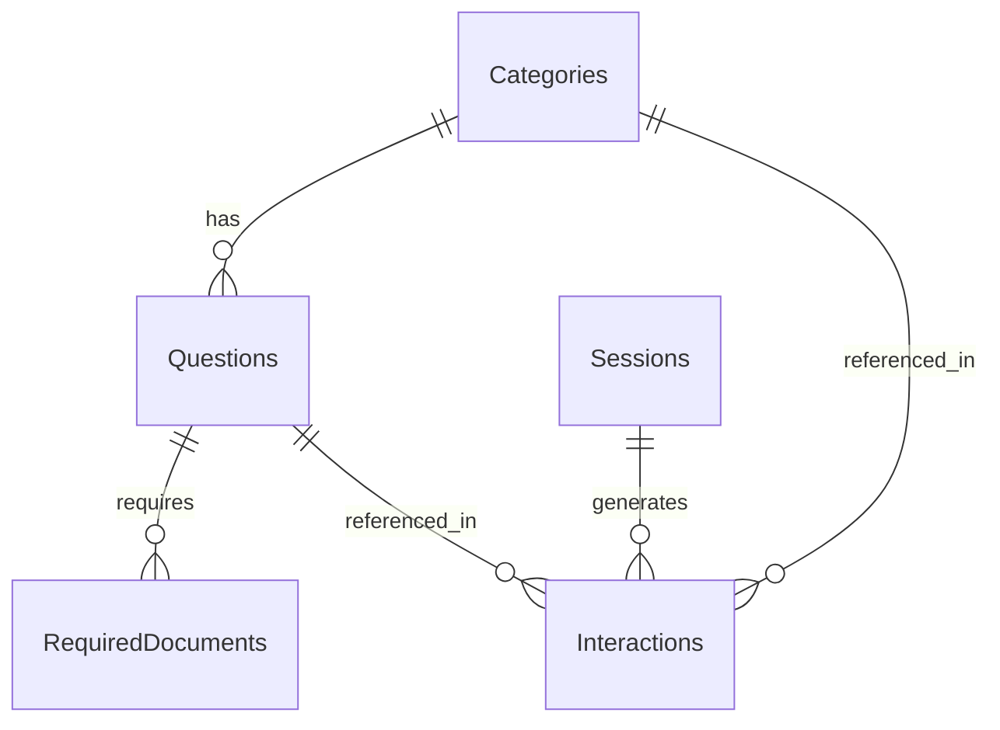
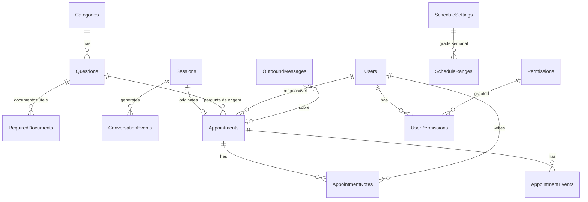

# Modelo de banco de dados — ProconChat Jacareí

> Persistência única em PostgreSQL, compartilhada entre o chatbot e o painel ([`../architecture/architecture.md`](../architecture/architecture.md)).
>
> Este documento tem duas partes:
> 1. **[Schema atual](#parte-1--schema-atual-implementado)**: o que existe hoje em `develop` (migrations `01` a `09`).
> 2. **[Schema planejado](#parte-2--schema-planejado-sprints-2-e-3)**: o que as decisões da Sprint 2 exigem, com a task de cada parte. É uma **proposta de referência** para a task S2-03 (migrations da Sprint 2): nomes e tipos podem ser ajustados na implementação, mas as regras não.
>
> Antes de mexer no banco, leia também o SQL atual em `src/backend/db/schema/` e as convenções em [`migrations.md`](migrations.md): **toda mudança é uma migration nova**, nunca edição de migration antiga.

**Convenções:** `BIGSERIAL` como chave primária; tabelas em PascalCase e colunas em snake_case, em inglês; `TIMESTAMPTZ`; `ENUM` para estados; `CHECK` para validações simples; índices nas colunas de busca e filtro.

---

## Parte 1 — Schema atual (implementado)

### Diagrama


```mermaid
erDiagram
    Categories ||--o{ Questions : has
    Questions ||--o{ RequiredDocuments : requires
    Sessions ||--o{ Interactions : generates
    Categories ||--o{ Interactions : referenced_in
    Questions ||--o{ Interactions : referenced_in
```

`Users` e `Appointments` existem, mas ainda não se relacionam com as demais tabelas.

### Categories

Categorias do fluxo guiado (7 no seed atual). `active` permite desativar sem excluir.

```sql
CREATE TABLE Categories (
    id BIGSERIAL PRIMARY KEY,
    title VARCHAR(150) NOT NULL,
    description TEXT,
    active BOOLEAN NOT NULL DEFAULT TRUE,
    created_at TIMESTAMPTZ NOT NULL DEFAULT CURRENT_TIMESTAMP,
    updated_at TIMESTAMPTZ NOT NULL DEFAULT CURRENT_TIMESTAMP
);
CREATE INDEX idx_categories_active ON Categories(active);
```

### Questions

Um item do FAQ do PROCON dentro de uma categoria (~47 no seed atual).

```sql
CREATE TABLE Questions (
    id BIGSERIAL PRIMARY KEY,
    category_id BIGINT NOT NULL REFERENCES Categories(id),
    question TEXT NOT NULL,
    legal_basis TEXT,
    answer TEXT NOT NULL,
    requires_in_person BOOLEAN NOT NULL DEFAULT FALSE,
    in_person_note TEXT,
    out_of_scope BOOLEAN NOT NULL DEFAULT FALSE,
    active BOOLEAN NOT NULL DEFAULT TRUE,
    created_at TIMESTAMPTZ NOT NULL DEFAULT CURRENT_TIMESTAMP,
    updated_at TIMESTAMPTZ NOT NULL DEFAULT CURRENT_TIMESTAMP
);
CREATE INDEX idx_questions_category ON Questions(category_id);
CREATE INDEX idx_questions_active ON Questions(active);
```

### RequiredDocuments

"Documentos úteis para esta dúvida", de cada pergunta (0..N).

```sql
CREATE TABLE RequiredDocuments (
    id BIGSERIAL PRIMARY KEY,
    question_id BIGINT NOT NULL REFERENCES Questions(id),
    description VARCHAR(255) NOT NULL
);
CREATE INDEX idx_required_documents_question ON RequiredDocuments(question_id);
```

### Users

Contas do painel. Ainda sem uso (não existe login).

```sql
CREATE TABLE Users (
    id BIGSERIAL PRIMARY KEY,
    name VARCHAR(150) NOT NULL,
    email VARCHAR(150) NOT NULL UNIQUE,
    password_hash TEXT NOT NULL,
    active BOOLEAN NOT NULL DEFAULT TRUE,
    created_at TIMESTAMPTZ NOT NULL DEFAULT CURRENT_TIMESTAMP
);
```

### Sessions

Uma conversa no WhatsApp. O telefone é guardado só como hash (`phone_hash`, HMAC com `PHONE_HASH_SECRET`).

```sql
CREATE TYPE session_status AS ENUM ('IN_PROGRESS', 'FINISHED', 'ABANDONED');

CREATE TABLE Sessions (
    id BIGSERIAL PRIMARY KEY,
    session_code UUID NOT NULL DEFAULT gen_random_uuid(),
    phone_hash VARCHAR(64) NOT NULL,
    status session_status NOT NULL DEFAULT 'IN_PROGRESS',
    started_at TIMESTAMPTZ NOT NULL DEFAULT CURRENT_TIMESTAMP,
    ended_at TIMESTAMPTZ
);
CREATE INDEX idx_sessions_phone_hash ON Sessions(phone_hash);
CREATE INDEX idx_sessions_code ON Sessions(session_code);

-- migration 08: uma única sessão em andamento por telefone
CREATE UNIQUE INDEX uniq_sessions_phone_in_progress ON Sessions(phone_hash) WHERE status = 'IN_PROGRESS';

-- migration 09: estado de navegação (o Motor de Decisão não guarda estado)
CREATE TYPE session_step AS ENUM ('AWAITING_CATEGORY', 'AWAITING_QUESTION', 'FINISHED');
ALTER TABLE Sessions
    ADD COLUMN current_step session_step NOT NULL DEFAULT 'AWAITING_CATEGORY',
    ADD COLUMN current_category_id BIGINT REFERENCES Categories(id);
```

### Interactions

Criada na Sprint 1 para o registro de interações (RF06), **mas nada grava nela ainda**. Será substituída pela tabela de eventos (Parte 2).

```sql
CREATE TABLE Interactions (
    id BIGSERIAL PRIMARY KEY,
    session_id BIGINT NOT NULL REFERENCES Sessions(id),
    category_id BIGINT REFERENCES Categories(id),
    question_id BIGINT REFERENCES Questions(id),
    answered_via_llm BOOLEAN NOT NULL DEFAULT FALSE,
    llm_answer_text TEXT,
    ended_in_appointment BOOLEAN NOT NULL DEFAULT FALSE,
    created_at TIMESTAMPTZ NOT NULL DEFAULT CURRENT_TIMESTAMP
);
```

### Appointments

Agendamentos presenciais (RF07). **Nenhum fluxo cria agendamentos ainda.**

```sql
CREATE TYPE appointment_status AS ENUM ('SCHEDULED', 'CANCELED', 'ATTENDED');

CREATE TABLE Appointments (
    id BIGSERIAL PRIMARY KEY,
    appointment_code UUID NOT NULL DEFAULT gen_random_uuid(),
    cpf_hash VARCHAR(64) NOT NULL,
    name VARCHAR(150) NOT NULL,
    appointment_reason TEXT NOT NULL,
    professional VARCHAR(50) NOT NULL CHECK (professional IN ('LAWYER', 'ATTENDANT')),
    appointment_datetime TIMESTAMPTZ NOT NULL,
    request_datetime TIMESTAMPTZ NOT NULL DEFAULT CURRENT_TIMESTAMP,
    status appointment_status NOT NULL DEFAULT 'SCHEDULED',
    notes TEXT
);
CREATE UNIQUE INDEX uniq_appointments_active ON Appointments(cpf_hash, appointment_datetime) WHERE status = 'SCHEDULED';
```

---

## Parte 2 — Schema planejado (Sprints 2 e 3)

As regras de negócio por trás de cada coluna estão nas decisões indicadas. **S2-xx / S3-xx** são as tasks do planejamento das sprints.

### Diagrama alvo


```mermaid
erDiagram
    Categories ||--o{ Questions : has
    Questions ||--o{ RequiredDocuments : "documentos úteis"
    Sessions ||--o{ ConversationEvents : generates
    Sessions ||--o| Appointments : originates
    Questions ||--o{ Appointments : "pergunta de origem"
    Users ||--o{ Appointments : "responsável"
    Appointments ||--o{ AppointmentNotes : has
    Appointments ||--o{ AppointmentEvents : has
    Users ||--o{ AppointmentNotes : writes
    Users ||--o{ UserPermissions : has
    Permissions ||--o{ UserPermissions : granted
    ScheduleSettings ||--o{ ScheduleRanges : "grade semanal"
    OutboundMessages }o--o| Appointments : "sobre"
```

Tabelas de configuração sem relação direta: `BlockedDates`, `AttendanceDocuments`, `WhatsAppSettings`, `AuditLog`.

### Contas e permissões — [decisão 004](../decisoes/004-contas-e-permissoes-granulares.md)

**S2-03 / S2-09 (Sprint 2):**

```sql
ALTER TABLE Users
    ADD COLUMN is_admin BOOLEAN NOT NULL DEFAULT FALSE,
    ADD COLUMN last_login_at TIMESTAMPTZ;

CREATE UNIQUE INDEX uniq_users_single_admin ON Users(is_admin) WHERE is_admin;
```

A conta Admin é criada por seed a partir de `ADMIN_EMAIL` e `ADMIN_PASSWORD`. O índice garante **um único Admin**.

**S3-01 (Sprint 3):**

```sql
CREATE TABLE Permissions (
    key VARCHAR(40) PRIMARY KEY,   -- ex.: appointments.view, appointments.manage, content.manage,
    name VARCHAR(100) NOT NULL,    --      schedule.configure, documents.configure, sessions.view,
    description TEXT NOT NULL      --      reports.view, users.manage
);

CREATE TABLE UserPermissions (
    user_id BIGINT NOT NULL REFERENCES Users(id),
    permission_key VARCHAR(40) NOT NULL REFERENCES Permissions(key),
    granted_by BIGINT REFERENCES Users(id),
    granted_at TIMESTAMPTZ NOT NULL DEFAULT CURRENT_TIMESTAMP,
    PRIMARY KEY (user_id, permission_key)
);
```

- O Admin não precisa de linhas em `UserPermissions`: `is_admin` libera tudo.
- As regras contra escalada (não alterar a própria conta, só conceder o que se tem etc.) ficam na camada de aplicação e são validadas na API.

### Conteúdo — [decisões 001](../decisoes/001-fluxo-guiado-por-categorias.md) e [009](../decisoes/009-complemento-por-llm.md)

**S2-03 / S2-13:**

```sql
ALTER TABLE Categories
    ADD COLUMN short_title VARCHAR(24),          -- título da lista do WhatsApp (obrigatório após o seed)
    ADD COLUMN position INT NOT NULL DEFAULT 0,  -- ordem exibida ao cidadão
    ADD COLUMN updated_by BIGINT REFERENCES Users(id);

ALTER TABLE Questions
    ADD COLUMN short_title VARCHAR(24),
    ADD COLUMN short_description VARCHAR(72),
    ADD COLUMN position INT NOT NULL DEFAULT 0,
    ADD COLUMN llm_allowed BOOLEAN NOT NULL DEFAULT TRUE,
    ADD COLUMN updated_by BIGINT REFERENCES Users(id),
    ADD CONSTRAINT chk_questions_in_person_xor_out_of_scope CHECK (NOT (requires_in_person AND out_of_scope)),
    ADD CONSTRAINT chk_questions_out_of_scope_no_llm CHECK (NOT (out_of_scope AND llm_allowed)),
    ADD CONSTRAINT chk_questions_answer_length CHECK (char_length(answer) <= 3000);

ALTER TABLE RequiredDocuments
    ADD COLUMN position INT NOT NULL DEFAULT 0;
```

- `short_title` fica anulável até o seed dos títulos curtos (S2-13); depois disso, vira `NOT NULL`.
- **Categoria "oculta"** (ativa, mas sem nenhuma pergunta ativa) é regra de consulta no Motor de Decisão, não coluna.

### Sessões e eventos da conversa — [decisões 008](../decisoes/008-fluxo-da-conversa-e-desfechos.md) e [010](../decisoes/010-registro-de-interacoes-e-relatorios.md)

**S2-03 / S2-06 / S2-08:**

```sql
CREATE TYPE session_outcome AS ENUM (
    'RESOLVED',             -- Resolvida sem agendamento
    'SCHEDULED',            -- Terminou em agendamento
    'OUT_OF_SCOPE',         -- Fora do escopo do PROCON
    'NO_SLOT',              -- Sem horário disponível na janela
    'DECLINED',             -- Não quis agendar
    'MANAGED_APPOINTMENT',  -- Remarcou ou cancelou agendamento existente
    'ABANDONED'             -- Sem interação por 30 minutos
);                          -- "Em andamento" = outcome NULL

ALTER TYPE session_step ADD VALUE 'AWAITING_ANSWER';          -- aguardando a resposta (LLM)
ALTER TYPE session_step ADD VALUE 'AWAITING_RESOLVED';        -- "A dúvida foi resolvida?"
ALTER TYPE session_step ADD VALUE 'AWAITING_SCHEDULE_OFFER';  -- Agendar / Agora não
ALTER TYPE session_step ADD VALUE 'AWAITING_ATTENDEE';        -- quem vai comparecer
ALTER TYPE session_step ADD VALUE 'AWAITING_HOLDER_DATA';     -- nome e CPF do titular
ALTER TYPE session_step ADD VALUE 'AWAITING_SLOT';            -- escolha do horário
ALTER TYPE session_step ADD VALUE 'AWAITING_RETURN_CHOICE';   -- Remarcar / Cancelar / Outra dúvida

ALTER TABLE Sessions
    ADD COLUMN outcome session_outcome,
    ADD COLUMN abandoned_at_step session_step,
    ADD COLUMN last_interaction_at TIMESTAMPTZ NOT NULL DEFAULT CURRENT_TIMESTAMP,
    ADD COLUMN current_question_id BIGINT REFERENCES Questions(id),
    ADD COLUMN list_page INT NOT NULL DEFAULT 1,
    ADD COLUMN draft JSONB;  -- dados temporários do agendamento em andamento (ex.: quem comparece)

CREATE INDEX idx_sessions_last_interaction ON Sessions(last_interaction_at) WHERE status = 'IN_PROGRESS';
```

- `last_interaction_at` sustenta o **timeout de 30 minutos**.
- `draft` guarda só o necessário entre uma etapa e outra do agendamento, e é limpo ao criar o agendamento ou ao encerrar a sessão. **O CPF nunca fica em `draft` em texto puro**: ele é validado e transformado em hash e versão mascarada na mesma mensagem em que chega.

```sql
CREATE TYPE conversation_event_type AS ENUM (
    'STARTED', 'CATEGORY_CHOSEN', 'QUESTION_CHOSEN',
    'ANSWER_SENT',            -- data: { llm: 'USED' | 'NOT_CALLED' | 'FAILED' }
    'RESOLVED_ANSWERED',      -- data: { resolved: true | false }
    'SCHEDULE_OFFERED',       -- data: { reason: 'REQUIRES_IN_PERSON' | 'NOT_RESOLVED' }
    'NO_SLOT', 'SCHEDULE_DECLINED',
    'ATTENDEE_CHOSEN',        -- data: { by_representative: bool }
    'APPOINTMENT_CREATED', 'APPOINTMENT_CONSULTED', 'APPOINTMENT_RESCHEDULED', 'APPOINTMENT_CANCELED',
    'ABANDONED'               -- data: { step }
);

CREATE TABLE ConversationEvents (
    id BIGSERIAL PRIMARY KEY,
    session_id BIGINT NOT NULL REFERENCES Sessions(id),
    type conversation_event_type NOT NULL,
    category_id BIGINT REFERENCES Categories(id),
    question_id BIGINT REFERENCES Questions(id),
    appointment_id BIGINT REFERENCES Appointments(id),
    data JSONB NOT NULL DEFAULT '{}',
    created_at TIMESTAMPTZ NOT NULL DEFAULT CURRENT_TIMESTAMP
);
CREATE INDEX idx_conversation_events_session ON ConversationEvents(session_id);
CREATE INDEX idx_conversation_events_type_date ON ConversationEvents(type, created_at);
```

- `ConversationEvents` **substitui `Interactions`**, que pode ser removida na mesma migration, já que está vazia.
- **Nenhum evento guarda texto digitado pelo cidadão** (RNF03).

### Agendamentos — [decisão 006](../decisoes/006-ciclo-de-vida-do-agendamento.md)

**S2-03 / S2-07 / S2-12:**

```sql
-- Status novo: PENDING → CONFIRMED → ATTENDED | NO_SHOW, ou CANCELED
ALTER TYPE appointment_status RENAME VALUE 'SCHEDULED' TO 'CONFIRMED';
ALTER TYPE appointment_status ADD VALUE 'PENDING';
ALTER TYPE appointment_status ADD VALUE 'NO_SHOW';

CREATE TYPE appointment_reason AS ENUM ('REQUIRES_IN_PERSON', 'NOT_RESOLVED');

ALTER TABLE Appointments
    DROP COLUMN professional,
    DROP COLUMN notes,
    DROP COLUMN appointment_reason,
    ADD COLUMN reason appointment_reason NOT NULL,
    ADD COLUMN session_id BIGINT NOT NULL REFERENCES Sessions(id),
    ADD COLUMN question_id BIGINT NOT NULL REFERENCES Questions(id),
    ADD COLUMN assigned_user_id BIGINT REFERENCES Users(id),
    ADD COLUMN by_representative BOOLEAN NOT NULL DEFAULT FALSE,
    ADD COLUMN cpf_masked VARCHAR(14) NOT NULL,       -- ***.456.789-**
    ADD COLUMN phone_encrypted TEXT,                  -- apagado quando o agendamento termina
    ADD COLUMN documents_sent JSONB NOT NULL,         -- { group: [...], question: [...] }
    ADD COLUMN rescheduled_from TIMESTAMPTZ,          -- data original, se o cidadão remarcou
    ADD COLUMN off_grid BOOLEAN NOT NULL DEFAULT FALSE; -- mantido fora da grade após mudança de agenda

ALTER TABLE Appointments ALTER COLUMN status SET DEFAULT 'PENDING';

CREATE INDEX idx_appointments_status_datetime ON Appointments(status, appointment_datetime);
CREATE INDEX idx_appointments_assigned ON Appointments(assigned_user_id);
```

- **`status` e `assigned_user_id` andam juntos:** `CONFIRMED` sempre tem responsável; `PENDING` nunca tem. Vale como `CHECK` ou validação na aplicação.
- **Vagas por horário:** como pode haver mais de uma vaga no mesmo horário, um índice único não basta. A criação do agendamento conta as vagas ocupadas **dentro de uma transação com trava** (ex.: `pg_advisory_xact_lock` pela data e hora) para duas pessoas não levarem a última vaga ao mesmo tempo.
- `uniq_appointments_active` passa a considerar `status IN ('PENDING','CONFIRMED')`, impedindo o mesmo CPF duas vezes no mesmo horário.
- O **motivo** e os **documentos enviados** são gravados na criação e não mudam depois.

```sql
CREATE TABLE AppointmentNotes (          -- observações internas: imutáveis
    id BIGSERIAL PRIMARY KEY,
    appointment_id BIGINT NOT NULL REFERENCES Appointments(id),
    author_user_id BIGINT NOT NULL REFERENCES Users(id),
    text TEXT NOT NULL,
    created_at TIMESTAMPTZ NOT NULL DEFAULT CURRENT_TIMESTAMP
);

CREATE TYPE appointment_event_type AS ENUM (
    'CREATED', 'ASSIGNED', 'RESCHEDULED', 'BACK_TO_PENDING',
    'ATTENDED', 'NO_SHOW', 'RECORD_CORRECTED',
    'CANCELED_BY_CITIZEN', 'CANCELED_BY_STAFF',
    'CITIZEN_NOTIFIED', 'CITIZEN_NOTIFICATION_FAILED',
    'REMINDER_SENT', 'KEPT_OFF_GRID'
);

CREATE TABLE AppointmentEvents (          -- histórico exibido no Detalhe do agendamento
    id BIGSERIAL PRIMARY KEY,
    appointment_id BIGINT NOT NULL REFERENCES Appointments(id),
    type appointment_event_type NOT NULL,
    actor_user_id BIGINT REFERENCES Users(id),  -- NULL quando foi o cidadão ou o sistema
    data JSONB NOT NULL DEFAULT '{}',           -- ex.: { from, to }, { reason }, { previous_status }
    created_at TIMESTAMPTZ NOT NULL DEFAULT CURRENT_TIMESTAMP
);
CREATE INDEX idx_appointment_events_appointment ON AppointmentEvents(appointment_id);
```

- `RECORD_CORRECTED` guarda em `data` o estado anterior, para "Corrigir registro" voltar a Pendente ou Confirmado corretamente.
- `CANCELED_BY_STAFF` guarda o motivo (lista fixa); a observação interna do cancelamento vai para `AppointmentNotes`.

### Agenda e unidade — [decisão 007](../decisoes/007-agenda-configuravel.md)

**S2-03 / S2-13 (valores por seed) · S3-03 (tela):**

```sql
CREATE TABLE ScheduleSettings (          -- linha única
    id SMALLINT PRIMARY KEY DEFAULT 1 CHECK (id = 1),
    slot_minutes SMALLINT NOT NULL CHECK (slot_minutes IN (20, 30, 40, 60)),
    seats_per_slot SMALLINT NOT NULL CHECK (seats_per_slot BETWEEN 1 AND 20),
    window_days SMALLINT NOT NULL CHECK (window_days BETWEEN 1 AND 180),
    min_notice_days SMALLINT NOT NULL CHECK (min_notice_days IN (0, 1, 2, 3, 5)),
    wait_alert_days SMALLINT NOT NULL CHECK (wait_alert_days BETWEEN 1 AND 60),
    unit_address TEXT NOT NULL,
    unit_address_complement TEXT,
    reminder_enabled BOOLEAN NOT NULL DEFAULT FALSE,
    reminder_hours SMALLINT NOT NULL DEFAULT 24 CHECK (reminder_hours IN (2, 6, 12, 24, 48)),
    updated_by BIGINT REFERENCES Users(id),
    updated_at TIMESTAMPTZ NOT NULL DEFAULT CURRENT_TIMESTAMP
);

CREATE TABLE ScheduleRanges (            -- grade semanal: até 3 faixas por dia
    id BIGSERIAL PRIMARY KEY,
    weekday SMALLINT NOT NULL CHECK (weekday BETWEEN 0 AND 6),  -- 0 = domingo
    start_time TIME NOT NULL,
    end_time TIME NOT NULL,
    CHECK (end_time > start_time)
);

CREATE TABLE BlockedDates (
    id BIGSERIAL PRIMARY KEY,
    date DATE NOT NULL,
    start_time TIME,                     -- NULL = dia inteiro (período é bônus B-07)
    end_time TIME,
    description VARCHAR(150) NOT NULL,
    CHECK ((start_time IS NULL) = (end_time IS NULL))
);
CREATE INDEX idx_blocked_dates_date ON BlockedDates(date);
```

- Sobreposição de faixas no mesmo dia e "faixa comporta ao menos um atendimento" são validadas na aplicação.
- "Dias úteis" da antecedência mínima = dias com faixa configurada e não bloqueados (regra de cálculo, não de schema).

### Documentos para atendimento presencial

**S2-03 / S2-13 (seed) · S3-04 (tela):**

```sql
CREATE TYPE attendee_group AS ENUM ('HOLDER', 'REPRESENTATIVE');

CREATE TABLE AttendanceDocuments (
    id BIGSERIAL PRIMARY KEY,
    attendee_group attendee_group NOT NULL,
    description VARCHAR(255) NOT NULL,
    position INT NOT NULL DEFAULT 0
);
```

Alterações não afetam agendamentos já criados, porque eles guardam a própria cópia em `Appointments.documents_sent`.

### WhatsApp e mensagens — [decisões 003](../decisoes/003-migracao-whatsapp-cloud-api.md) e [005](../decisoes/005-mensagens-ao-cidadao.md)

**S2-03 / S2-04 / S2-05:**

```sql
CREATE TABLE WhatsAppSettings (          -- linha única
    id SMALLINT PRIMARY KEY DEFAULT 1 CHECK (id = 1),
    phone_number_id VARCHAR(40),
    business_account_id VARCHAR(40),
    access_token_encrypted TEXT,         -- cifrado com a chave-mestra do .env
    app_secret_encrypted TEXT,           -- idem
    verify_token VARCHAR(64) NOT NULL,   -- gerado pelo sistema
    auto_reply_paused BOOLEAN NOT NULL DEFAULT FALSE,
    last_webhook_event_at TIMESTAMPTZ,
    credentials_checked_at TIMESTAMPTZ,
    credentials_valid BOOLEAN,
    updated_by BIGINT REFERENCES Users(id),
    updated_at TIMESTAMPTZ NOT NULL DEFAULT CURRENT_TIMESTAMP
);

CREATE TYPE outbound_kind AS ENUM ('REPLY', 'CONFIRMATION', 'PAUSED', 'CANCELLATION', 'REMINDER');
CREATE TYPE outbound_status AS ENUM ('SENT', 'DELIVERED', 'READ', 'FAILED');

CREATE TABLE OutboundMessages (          -- base de "Falhas de entrega" e do reenvio
    id BIGSERIAL PRIMARY KEY,
    provider_message_id VARCHAR(128) UNIQUE,
    kind outbound_kind NOT NULL,
    session_id BIGINT REFERENCES Sessions(id),
    appointment_id BIGINT REFERENCES Appointments(id),
    status outbound_status NOT NULL DEFAULT 'SENT',
    error_code VARCHAR(40),
    sent_at TIMESTAMPTZ NOT NULL DEFAULT CURRENT_TIMESTAMP,
    status_at TIMESTAMPTZ
);
CREATE INDEX idx_outbound_failed ON OutboundMessages(status, sent_at) WHERE status = 'FAILED';
```

- `OutboundMessages` **não guarda o texto nem o telefone**, só o tipo e o status.
- Qualidade do número, limite de envios e status dos modelos (S3-06) são consultados na API da Meta, e não precisam de tabela.

### Auditoria das configurações

**S2-05 (WhatsApp) · S3 (demais telas):**

```sql
CREATE TABLE AuditLog (
    id BIGSERIAL PRIMARY KEY,
    area VARCHAR(40) NOT NULL,           -- whatsapp, schedule, documents, content, users
    action VARCHAR(80) NOT NULL,         -- ex.: credentials_replaced, paused, ranges_changed
    actor_user_id BIGINT REFERENCES Users(id),
    data JSONB NOT NULL DEFAULT '{}',    -- nunca contém segredos
    created_at TIMESTAMPTZ NOT NULL DEFAULT CURRENT_TIMESTAMP
);
CREATE INDEX idx_audit_log_area ON AuditLog(area, created_at);
```

Alimenta o "Histórico de alterações" da tela de WhatsApp e o "Última alteração por … em …" das telas de configuração.

### Dados pessoais: resumo

| Dado | Onde | Forma |
|---|---|---|
| Telefone | `Sessions.phone_hash` | Hash (HMAC) |
| Telefone | `Appointments.phone_encrypted` | Criptografado; apagado quando o agendamento termina (S3-09) |
| CPF | `Appointments.cpf_hash`, `cpf_masked` | Hash + versão mascarada |
| Nome do titular | `Appointments.name` | Texto (a equipe precisa identificar a pessoa) |
| Texto digitado pelo cidadão | — | **Não é guardado** |
| Segredos da Cloud API | `WhatsAppSettings` | Criptografados |

A política de retenção (por quanto tempo sessões, eventos e agendamentos ficam guardados) é definida na S3-09.
