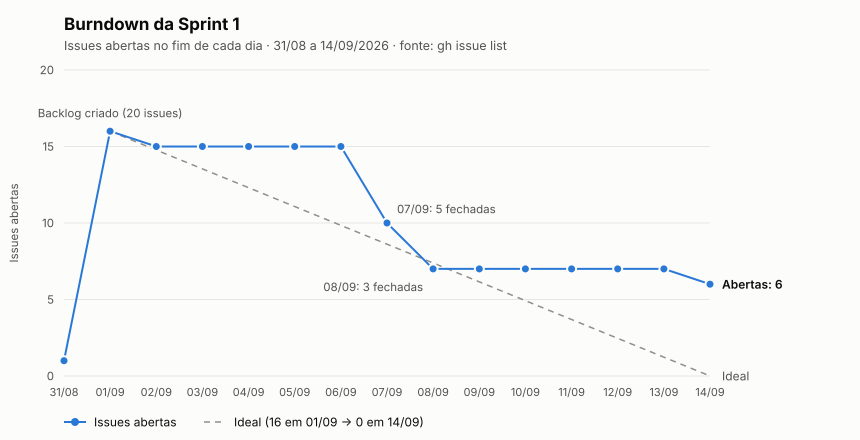

# Entrega da Sprint 1 — ProconChat Jacareí

> Documento de fechamento da Sprint 1 do projeto ABP do 6º DSM (Fatec Jacareí, 2026-2), em parceria com o PROCON de Jacareí-SP.
> Período da Sprint 1 conforme cronograma oficial: **10/08/2026 a 14/09/2026**.
> Repositório: `Steel-Hard/ProconChat_Jacarei` (nome antigo: `Steel-Hard/prov_6DSM`).
> Branch de integração: `develop`.
> Data de geração deste documento: **14/09/2026**.

---

## Arquivos deste fechamento

| Arquivo | Seções originais | Conteúdo |
|---|---|---|
| [01-requisitos.md](01-requisitos.md) | 3 | Situação de cada RF, RNF e RP em 14/09 |
| [02-arquitetura-dados-stack.md](02-arquitetura-dados-stack.md) | 4, 5 e 6 | Componentes, modelo de dados, stack e desempenho do LLM |
| [03-convencoes.md](03-convencoes.md) | 7 | Git e fluxo de planejamento |
| [04-issues-e-prs.md](04-issues-e-prs.md) | 8 e 10 | Issues, distribuição do trabalho e pull requests |
| [05-burndown.md](05-burndown.md) · [burndown.svg](burndown.svg) | 9 | Gráfico e tabelas do burndown |
| [06-entregas-14-09.md](06-entregas-14-09.md) | 11 | Entregas do último dia, bugs corrigidos e demonstração |
| [07-riscos-e-proximos-passos.md](07-riscos-e-proximos-passos.md) | 12 e 13 | Riscos, pendências e sugestões para a Sprint 2 |

As referências no texto a "seção 9.6", "seção 12.1" etc. usam a numeração original, indicada na tabela acima.

---

## 1. Resumo executivo

O **ProconChat Jacareí** é um chatbot de orientação ao consumidor, acessado via WhatsApp, desenvolvido para o PROCON de Jacareí-SP com o objetivo de responder às dúvidas recorrentes do cidadão (prazos, documentos, procedimentos de reclamação) sem exigir deslocamento presencial, reduzindo a sobrecarga do atendimento humano. A navegação é guiada por uma tabela de decisões (categorias e perguntas) fornecida pelo próprio PROCON, e um modelo de linguagem local (Ollama) pode complementar a resposta apenas com texto explicativo — nunca decidindo o fluxo.

**O que a Sprint 1 entregou, em uma frase:** um chatbot funcional de ponta a ponta, rodando inteiramente em Docker, que recebe mensagens reais no WhatsApp, navega o fluxo guiado de 7 categorias com 47 itens reais do FAQ do PROCON e devolve a resposta orientadora formatada com base legal e aviso de caráter não vinculante — com o serviço LLM implementado e validado, porém ainda não plugado ao fluxo de conversa.

---

## 2. Contexto do projeto

| Item | Valor |
|---|---|
| Disciplina | ABP — Aprendizagem Baseada em Projetos |
| Instituição / Curso | Fatec Jacareí — 6º DSM (2026-2) |
| Parceiro | PROCON — Fundação de Proteção e Defesa do Consumidor de Jacareí-SP |
| Contato do parceiro | Renan de Oliveira Corrêa (Diretor de Assuntos da Cidadania) |
| Focal point (professor) | Prof. Marcelo Augusto Sudo |
| Tema do semestre | Chatbot para Orientação ao Consumidor via WhatsApp |
| Kick off | 09/08/2026 |

### O problema apresentado pelo parceiro

O PROCON de Jacareí atende diariamente consumidores em busca de orientação sobre direitos, procedimentos, prazos e documentos. **Grande parte dessas demandas é recorrente** e segue fluxos decisórios já definidos por normas legais e diretrizes institucionais. O atendimento humano fica sobrecarregado por perguntas repetitivas e por usuários que não sabem qual procedimento seguir, o que piora o tempo de resposta e a eficiência do serviço público.

### A solução proposta

Um sistema cujo principal ponto de interação é um chatbot no WhatsApp, que:

- guia o cidadão de forma estruturada com base na tabela de decisões do PROCON;
- apresenta, ao final do fluxo, uma resposta orientadora consolidada com próximos passos;
- pode complementar essa resposta com texto explicativo gerado por LLM local, **sem caráter jurídico vinculante**;
- quando a resposta não resolve a dúvida, encaminha para **agendamento presencial**, orientando sobre a documentação necessária.

A solução **não substitui** o atendimento formal do PROCON — é um canal inicial de orientação.

### Cronograma do semestre

| Etapa | Início | Fim |
|---|---|---|
| Kick off | 10/08/2026 | — |
| **Sprint 1** | **10/08/2026** | **14/09/2026** |
| Sprint 2 | 15/09/2026 | 19/10/2026 |
| Sprint 3 | 20/10/2026 | — |
| Review Meeting | — | 23/11/2026 |

---

## 14. Anexos e referências internas

| Assunto | Caminho no repositório |
|---|---|
| Documento oficial do desafio (transcrição do PDF) | `.docs/desafio/desafio-6dsm-2026-2.md` |
| FAQ real do PROCON (~47 itens) | `.docs/database/Dúvidas Frequentes.odt` |
| Arquitetura formal (com diagrama Mermaid) | `.docs/architecture/architecture.md` |
| Modelo de dados (diagrama ER + `CREATE TABLE`) | `.docs/database/database.md` |
| SQL de referência por tabela | `src/backend/db/schema/` |
| Migrations numeradas (01 a 09) | `src/backend/db/migrations/` |
| Contrato do LLM Service | `.docs/llm/contrato.md` |
| Escolha e benchmark do modelo LLM | `.docs/llm/modelo.md` |
| Pesquisa WhatsApp (Cloud API x Evolution API) | `.docs/whatsapp/pesquisa.md` |
| Spec do bug do webhook (PR #44) | `.docs/.tasks/bugs/webhook-eventos-mensagem-ignorados/` |
| Spec do aviso RNF04 (PR #43) | `.docs/.tasks/features/avisos-obrigatorios-resposta-final/` |
| Orquestração Docker | `compose.yaml` |
| Convenções de git | `CONTRIBUTING.md` |
| Instruções de instalação | `README.md` |
| Board da equipe | GitHub Project #2 da org `Steel-Hard` |

### Nota final sobre a fidelidade deste documento

Os dados de issues e pull requests foram obtidos diretamente da API do GitHub em 14/09/2026 e refletem o estado real do repositório naquele momento. **Duas divergências em relação a relatos anteriores foram corrigidas aqui:** os PRs #43 e #44 constam como **mergeados** (não apenas abertos), e as issues #6 e #17 constam como **fechadas** (não abertas). O único dado que **não pôde ser obtido** foi o status fino de cada item no board do GitHub Project — a chamada falhou de forma persistente neste ambiente, e nenhum valor foi inventado para substituí-lo.
