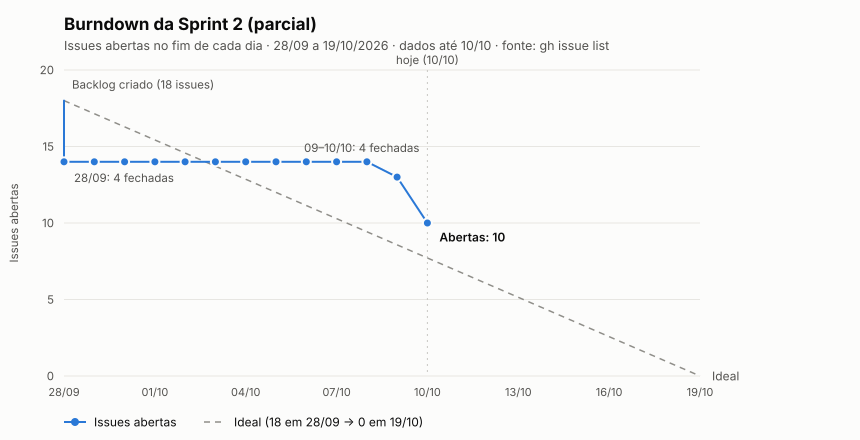

# Sprint 2 — ProconChat Jacareí

> Acompanhamento da Sprint 2 do projeto ABP do 6º DSM (Fatec Jacareí, 2026-2), em parceria com o PROCON de Jacareí-SP.
> Período da Sprint 2 conforme cronograma oficial: **15/09/2026 a 19/10/2026**.
> Repositório: `Steel-Hard/ProconChat_Jacarei` · branch de integração: `develop` · board: GitHub Project #2 da org `Steel-Hard`.
> **Documento parcial**, com dados de **10/10/2026** (faltam 9 dias para o fim da sprint). O fechamento será feito em 19/10.

---

## Arquivos

| Arquivo | Conteúdo |
|---|---|
| [README.md](README.md) | Placar, tarefas concluídas com datas, tarefas em aberto e riscos |
| [burndown.md](burndown.md) · [burndown.svg](burndown.svg) | Gráfico, série diária e leitura do burndown |

---

## 1. Placar em 10/10

| Item | Valor |
|---|---|
| Issues da sprint (label `SPRINT 2`) | **18** (17 criadas em 28/09 + #16, que veio da Sprint 1) |
| Concluídas (Done) | **8** (44%) |
| Em aberto | **10**, todas em **Ready** (nenhuma em andamento) |
| Reprovadas na revisão | **3** (#55, #56, #60) |
| Linha ideal em 10/10 | ~8 abertas |
| Situação | **Atrasada em cerca de 2 issues** em relação à linha ideal |

Por tamanho:

| Tamanho | Concluídas | Em aberto |
|---|---|---|
| P | 3 (#50, #61, #82) | 1 (#84) |
| M | 4 (#51, #53, #58, #81) | 7 (#16, #54, #57, #60, #83, #85, #86) |
| G | 1 (#52) | 2 (#55, #56) |

O que já foi concluído é sobretudo a base da sprint: banco, seed, CI, estrutura e layout do frontend, WhatsApp Cloud API e ambiente de produção. Quase todo o trabalho de funcionalidade (bot novo, agendamento, autenticação e telas) ainda está em aberto.

---

## 2. Tarefas concluídas (Done)

Horários no fuso de Brasília. **Início** é o primeiro sinal de trabalho na issue: a ida para "In progress" no board quando ela ficou registrada (#52 e #58), ou, nas demais, o primeiro commit com `[#N]` na `develop`. **Fim** é o fechamento da issue no merge do PR.

| # | Tarefa | Tamanho | Responsável | Início | Fim | Duração | PR |
|---|---|---|---|---|---|---|---|
| #52 | Migrations do schema da Sprint 2 | G | felipe-sant | 28/09 00:52 | 28/09 19:34 | mesmo dia | #89 |
| #58 | Frontend: estrutura a partir do template-react, Docker e CI | M | felipe-sant | 27/09 23:41 | 28/09 22:20 | 1 dia | #91 |
| #61 | Seed da configuração inicial e títulos curtos do conteúdo | P | felipe-sant | 28/09 20:09 | 28/09 21:23 | mesmo dia | #90 |
| #50 | CI no monorepo (build, lint e testes em cada PR) | P | felipe-sant | 28/09 21:54 | 28/09 22:20 | mesmo dia | #91 |
| #53 | Gateway: WhatsApp Cloud API (receber e enviar mensagens) | M | felipe-sant | 02/10 17:15 | 09/10 19:45 | 7 dias | #95 |
| #51 | Ambiente de produção em VM com deploy contínuo | M | felipe-sant | 09/10 20:30 | 10/10 01:26 | 1 dia | #96 |
| #82 | Remover Evolution API e Redis e documentar o app de teste da Meta | P | felipe-sant | 10/10 01:39 | 10/10 01:57 | mesmo dia | #97 |
| #81 | Frontend: layout do painel e componentes compartilhados | M | felipe-sant | 10/10 11:20 | 10/10 17:57 | mesmo dia | #98 |

> O histórico de status do board está incompleto: a maior parte das mudanças de coluna não ficou registrada na API do GitHub. Por isso, o início das tarefas sem "In progress" registrado vem do primeiro commit, e o tempo real de trabalho pode ter começado antes.

---

## 3. Tarefas em aberto

| # | Tarefa | Tamanho | Responsável | Status | Depende de | Situação |
|---|---|---|---|---|---|---|
| #16 | Registro de eventos da conversa e desfechos | M | claudsaints | Ready | #52 ✅ | Desbloqueada desde 28/09, não iniciada. Veio da Sprint 1 |
| #57 | Autenticação: backend (login, sessão, permissões e conta Admin) | M | claudsaints | Ready | #52 ✅ | Desbloqueada desde 28/09, não iniciada |
| #55 | Bot: novo fluxo da dúvida | G | Nickaqui | Ready | #16 | **Reprovada** em 10/10; aguarda #16 |
| #56 | Bot: agendamento presencial e horários livres | G | Nickaqui | Ready | #55, #16 | **Reprovada** em 10/10; aguarda #55 |
| #60 | API de agendamentos: lista, detalhe e ações de status | M | Nickaqui | Ready | #57, #16 | **Reprovada** em 10/10; aguarda #57 e #16 |
| #83 | Configuração do WhatsApp no banco | M | — | Ready | #57 | Aguarda #57; sem responsável |
| #84 | Autenticação: tela de login e Minha conta | P | — | Ready | #57, #81 ✅ | Aguarda #57; sem responsável |
| #54 | Tela de WhatsApp | M | — | Ready | #83, #84 | Aguarda #83 e #84; sem responsável |
| #85 | Tela de Agendamentos (lista) | M | — | Ready | #60, #84 | Aguarda #60 e #84; sem responsável |
| #86 | Tela de Detalhe do agendamento | M | — | Ready | #60, #84 | Aguarda #60 e #84; sem responsável |

---

## 4. Riscos

1. **#16 e #57 são o gargalo da sprint.** Todas as outras 8 tarefas em aberto dependem, direta ou indiretamente, de uma das duas. Ambas estão desbloqueadas desde 28/09 e ainda não começaram. Cada dia sem elas empurra todo o restante.
2. **Cadeia longa até as telas de agendamento:** #16 e #57 → #60 → #85 e #86. São três etapas em sequência para 9 dias.
3. **Retrabalho nas reprovadas.** #55, #56 e #60 foram implementadas antes das dependências e reprovadas na revisão (ver comentários nas issues). Parte do código pode ser reaproveitada, mas precisa ser refeita em cima da #16 e da #57. Os branches já foram atualizados com a `develop`.
4. **Cinco tarefas sem responsável** (#54, #83, #84, #85, #86), quase todas de frontend.
5. **Concentração:** as 8 tarefas concluídas foram entregues pela mesma pessoa.
6. **Início tardio:** o backlog da sprint só foi criado em 28/09, 13 dias depois do início oficial (15/09).
