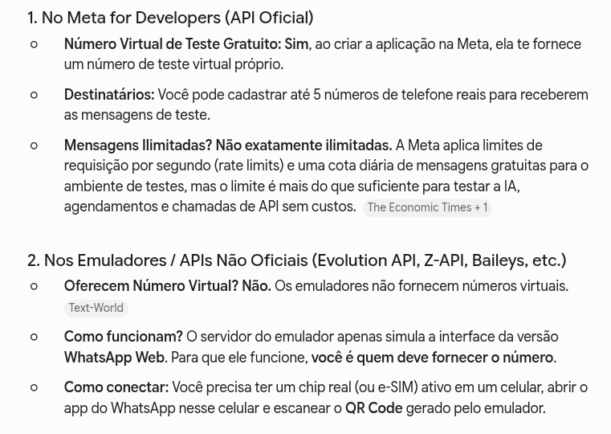

## Buscamos as opções para criar o gateway

Conforme a imagem anexa, há dois caminhos principais: a Meta e emuladores.
Tentamos fazer o cadastro para Desenvolvedores na Meta, mas descobrimos que números já inscritos no Whatsapp não são aceitos para a inscrição no programa.

Visando a economia de recursos na fase do desenvolvimento e conforme a pesquisa em conjunto com o Lucas, optamos por seguir o desenvolvimento do gateway utilizando o Evolution API, conforme a documentação disponível em: [https://docs.evolutionfoundation.com.br/evolution-api/install/docker](https://docs.evolutionfoundation.com.br/evolution-api/install/docker)
